# 📘 LabLink Custom Features - User Guide

<div align="center">


**Your Guide to LabLink Custom Features**

*Simple, practical instructions for using LabLink's custom enhancements*

</div>

---

## 📋 What's New in Your System?

This guide covers the **custom features** added specifically for LabLink. We assume you already know how to use standard Odoo.

### 🎯 Key Custom Features


---

## 📋 Table of Contents

1. [Getting Started](#-getting-started)
2. [Multi-Level Approval System](#-multi-level-approval-system)
3. [Enhanced Partner Management](#-enhanced-partner-management)
4. [Enhanced Product Management](#-enhanced-product-management)
5. [CRM Automation Features](#-crm-automation-features)
6. [Advanced Sales Features](#-advanced-sales-features)
7. [Sales Order Validations](#-sales-order-validations)
8. [Email Thread Continuity](#-email-thread-continuity)
9. [Sri Lankan Tax Configuration](#-sri-lankan-tax-configuration)
10. [Quick Reference Guide](#-quick-reference-guide)

---

## 🚀 Getting Started

### What You Need to Know

**Before using these features:**
- You should be comfortable with basic Odoo operations
- These features are **additions** to standard Odoo
- Your administrator should have already configured the system

### Who Uses What?

| Your Role | You'll Use |
|-----------|-----------|
| **Administrator** | All configuration settings, approval setups |
| **Approver** | Approval features for partners, products, sales |
| **Sales Team** | Enhanced quotations, CRM automation, email threading |
| **Finance Team** | Sales validations, tax types, credit monitoring |

---

## 🔐 Multi-Level Approval System

### What Is This?

A flexible approval system where items can go through 1, 2, or 3 levels of approval before being finalized.

**Used For:**
- Approving new customers/vendors
- Approving new products
- Approving sales orders (under certain conditions)

### Approval Flow Visualization

```mermaid
stateDiagram-v2
    [*] --> Draft: Create
    Draft --> Level1: Request Approval
    Level1 --> Level2: Level 1 Approves
    Level2 --> Level3: Level 2 Approves
    Level3 --> Approved: Level 3 Approves
    Level2 --> Approved: (if only 2 levels)
    Level1 --> Approved: (if only 1 level)

    Level1 --> Draft: Rejected
    Level2 --> Draft: Rejected
    Level3 --> Draft: Rejected

    note right of Approved
        ✓ Ready to use
    end note
```



### How to Configure Approval Levels

**Path:** `Settings → Multi Approvals → Approval Level Configuration`

**Steps:**

1. **Click Create**

2. **Basic Setup:**
   - **Name:** Give it a clear name (e.g., "Partner Approval - 2 Levels")
   - **Model:** Choose what needs approval (Partners or Products)
   - **Level of Approval:** Choose 1, 2, or 3 levels

3. **Add Approvers for Each Level:**

   **Level 1:**
   - Click "Add" under "First Level Approval"
   - Select users who can approve at first level
   - Check "Should Approve All" if EVERY person must approve
   - Leave unchecked if ANY ONE person's approval is enough

   **Level 2 (if needed):**
   - Click "Add" under "Second Level Approval"
   - Select level 2 approvers
   - Set approval method (All or Any)

   **Level 3 (if needed):**
   - Click "Add" under "Third Level Approval"
   - Select level 3 approvers
   - Set approval method (All or Any)

4. **Save**

**Example Configuration:**
```
Configuration: Partner Approval - 2 Levels

Level 1:
  Approvers: Sales Manager
  Method: Any can approve

Level 2:
  Approvers: Finance Manager, Operations Manager
  Method: All must approve
```

### Understanding Approval Methods

```mermaid
graph TD
    A[Approval Level with 3 Users] --> B{Approval Method?}

    B -->|All Must Approve| C[User 1 Approves]
    C --> D[User 2 Approves]
    D --> E[User 3 Approves]
    E --> F[✓ Level Complete]

    B -->|Any Can Approve| G[ANY User Approves]
    G --> H[✓ Level Complete]

    style F fill:#2E7D32,stroke:#fff,stroke-width:2px,color:#fff
    style H fill:#2E7D32,stroke:#fff,stroke-width:2px,color:#fff
```



| Method | What It Means | When to Use |
|--------|---------------|-------------|
| **All Must Approve** | Every selected person must approve | Important decisions requiring consensus |
| **Any Can Approve** | Just one person's approval is enough | Routine approvals |

---

## 👥 Enhanced Partner Management

### New Partner Fields

When creating or editing a partner, you'll see these additional fields:

#### Customer Classification Section

**Purpose:** Better categorize your customers

| Field | What It's For | Example |
|-------|---------------|---------|
| **Customer Type** | Government or Private sector | Government |
| **Customer Type SSCL** | Additional classification | Public Health Institution |
| **Business Nature** | Type of organization | Hospital |
| **Type of Business** | Business description | Multi-specialty Hospital |
| **GRN Type** | Goods receipt type | Local |

**How to Configure:**
- `Settings → Lablink Configuration → Business Nature` - Add options like Hospital, Laboratory, Research Institute
- `Settings → Lablink Configuration → Customer Type` - Add your custom classifications

#### Sales Configuration Section

| Field | What It's For |
|-------|---------------|
| **Quotation Officer** | Default salesperson for this customer |
| **Commission (%)** | Default commission rate |

#### Tax Configuration

| Field | Options | What It Does |
|-------|---------|--------------|
| **VAT Type** | VAT / SVAT / Non-VAT / GST | Automatically applies correct tax to sales orders |

> **💡 Tip:** Government customers typically use SVAT (8%) instead of VAT (18%)

#### Document Management

**Three document upload sections:**
- **Business Registration Documents**
- **VAT Registration Documents**
- **Customer Registration Documents**

**Document Grace Period:**
- System tracks how long documents are pending
- Configurable grace period (default 14 days)
- Status changes if documents not uploaded in time

**Configure Grace Period:**
`Settings → General Settings → Partner Document Validate Period`

### Partner Approval Workflow

```mermaid
graph TB
    A[Create Partner] --> B[Fill All Details]
    B --> C{Upload Documents?}
    C -->|Yes| D[Documents Attached ✓]
    C -->|No| E[Will Upload Later]
    D --> F[Request Approval]
    E --> F

    F --> G{Approval Process}
    G --> H[Level 1 Approves]
    H --> I{Multi-Level?}
    I -->|Yes| J[Level 2 Approves]
    J --> K{3 Levels?}
    K -->|Yes| L[Level 3 Approves]
    K -->|No| M{Documents Present?}
    I -->|No| M
    L --> M

    M -->|Yes| N[Status: Approved ✓]
    M -->|No| O[Status: Pending Document ⚠️]

    O --> P{Upload Within Period?}
    P -->|Yes| Q[Upload Documents]
    Q --> R[Click: State For Approved]
    R --> N

    P -->|Period Expired| S[Status: Approved Without Doc ⚠️]

    style N fill:#2E7D32,stroke:#fff,stroke-width:2px,color:#fff
    style O fill:#F57C00,stroke:#fff,stroke-width:2px,color:#fff
    style S fill:#C62828,stroke:#fff,stroke-width:2px,color:#fff
```



**Steps to Request Approval:**

1. Open the partner
2. Click **"Request For Approval"** button
3. Select approvers (if single-level) or automatic (if multi-level)
4. Click **"Send Request"**
5. Approvers receive email notification
6. Wait for approval

**For Approvers:**

1. Open partner showing "Waiting Approval"
2. Review all information
3. Click **"Approve"** or **"Reject"**
4. Add notes (optional)
5. Confirm

**Handling Missing Documents:**

If partner approved without documents:
1. Upload the missing documents
2. Click **"State For Approved"** button
3. Status changes to Approved

---

## 📦 Enhanced Product Management

### New Product Fields

**Product Identification:**
- **Product Code:** Your internal product code
- **Warranty Period:** Warranty information (e.g., "24 months")
- **Country of Origin:** Where it's manufactured
- **Brand:** Product brand (select from brand master)

**Product Catalogs:**
- **Upload product brochures, datasheets, specifications**
- **⚠️ MANDATORY before requesting approval**

### Product Categories with Codes

**Added to Categories:**
- **Category Code:** Short code (e.g., "LAB" for Laboratory Equipment)
- **GP Margin (%):** Minimum profit margin for this category

**Internal Reference Auto-Generation:**
```
Your Product Code: LB-001
Category Code: LAB
→ Internal Reference becomes: LAB-LB-001
```

### Product Brands

**New Menu:** `Inventory → Configuration → Brands`

**Features:**
- Add brand name
- Upload brand logo
- System counts how many products use each brand

### Product Approval Workflow

```mermaid
graph TB
    A[Create Product] --> B[Fill All Details]
    B --> C{Upload Product Catalogs}
    C -->|No| D[❌ Cannot Request Approval<br/>Error Message]
    C -->|Yes| E[Click: Request For Approval]

    D --> F[Upload Catalogs First]
    F --> E

    E --> G[Product Locked 🔒<br/>Cannot Edit During Approval]
    G --> H[Approver Reviews]

    H --> I{Decision}
    I -->|Approve| J[Status: Approved ✓]
    I -->|Reject| K[Status: Draft<br/>Can Edit Again]

    J --> L[Available in All Transactions ✓]
    K --> M[Fix Issues & Resubmit]

    style J fill:#2E7D32,stroke:#fff,stroke-width:2px,color:#fff
    style D fill:#C62828,stroke:#fff,stroke-width:2px,color:#fff
    style L fill:#2E7D32,stroke:#fff,stroke-width:2px,color:#fff
```



**Critical Rule:**

> **⚠️ Only APPROVED products can be used in sales orders, purchase orders, invoices, and stock moves**

**What Happens if Product Not Approved:**

When trying to add to transaction:
```
❌ Error: Product must be approved before use
```

**How to Fix:**
1. Go to the product
2. Upload product catalogs (if missing)
3. Request approval
4. Wait for approval
5. Try again

---

## 📞 CRM Automation Features

### What's Automated?

#### 1. Auto-Stage Update

**What It Does:**
- When you create a quotation from a lead → Lead automatically moves to "Quotation Sent" stage
- When you confirm the order → Lead automatically moves to "Won" stage

**Configure:**
`Settings → CRM Settings`

Set these fields:
- **State After Quotation Creation** → Select the stage (e.g., "Quotation Sent")
- **State After Sale Order Confirmation** → Select the stage (e.g., "Won")


#### 2. Auto-Close Stale Leads

**What It Does:**
- Automatically closes leads where quotations were sent but not confirmed within X months
- Marks them as "Lost" with your configured reason

**Configure:**
`Settings → CRM Settings`

- ✓ **Should Close Leads Automatically**
- **Months After Closed:** Enter number (e.g., 3)
- **Reason For Lost:** Select reason (e.g., "No Response")

**When It Runs:**
- Daily at 2:00 AM
- Reviews all leads with old quotations
- Closes the ones that haven't converted

#### 3. Salesperson Auto-Assignment

**What It Does:**
When you create a lead and select a customer, the salesperson automatically fills in from that customer's "Quotation Officer" field.

**No configuration needed** - works automatically!

---

## 💼 Advanced Sales Features

### New Fields on Sales Orders

#### Quotation Details

**New fields to customize your quotations:**

| Field | Purpose | Example |
|-------|---------|---------|
| **Quotation Officer** | Who's handling this quotation | John Silva |
| **Quotation Type** | Type of quote | Tender / Sample / Normal |
| **Quotation Heading** | Custom heading on PDF | "Medical Equipment Supply" |
| **Contact Person** | Customer's contact | Dr. Perera |
| **Contact Number** | Contact's phone | +94 77 123 4567 |

#### Priority Management

**New field:** `Priority Level`

**Options:**
- 🔴 Very Urgent
- 🟠 Urgent
- ⚫ Regular

**Configure Priorities:**
`Sales → Configuration → Sale Order Priority`

Create your own priority levels with colors!

#### Order Information

| Field | What It Tracks |
|-------|----------------|
| **Inquiry Date** | When customer inquiry received |
| **PO Number** | Customer's purchase order number |
| **PO Received Date** | When PO was received |

#### Commission Management

| Field | Purpose |
|-------|---------|
| **Commission (%)** | Default from customer |
| **Enable Special Rate** | Check to use different rate |
| **Special Rate (%)** | Override commission for this order |
| **Commission Description** | Notes about commission |

#### Credit Monitoring

**Pending Credit Days:** Shows how many days since customer's oldest unpaid invoice

> **💡 Helps identify customers with payment delays**

### New Fields on Order Lines

#### Product Information Auto-Displayed

When you add a product, these automatically show:
- Internal Reference
- Brand
- Country of Origin
- Warranty Period

#### Availability

**Select delivery lead time:**
- Import & supply within 2-4 weeks
- 4-6 weeks
- 6-8 weeks
- etc.

**Configure Options:**
`Sales → Configuration → Availability`

#### Price History (Very Useful!)

**System automatically shows:**
- **Last Quoted Price:** Last price you quoted to THIS customer for THIS product
- **Last Invoiced Price:** Last price you invoiced to THIS customer

> **💡 Helps maintain consistent pricing across orders**


#### Auto-Numbering

All lines automatically get sequence numbers (1, 2, 3...) displayed on reports.

---

## ✅ Sales Order Validations

### What Are Sales Validations?

**Three checkpoints** that can block order confirmation until approved:

1. **GP Margin Validation** - Ensures you maintain minimum profit
2. **Credit Limit Validation** - Prevents exceeding customer credit limits
3. **Payment Terms Validation** - Blocks orders from customers with overdue payments

### Complete Validation Flow


### How to Configure

**Path:** `Settings → Sales → Sales Validations`

#### 1. GP Margin Validation

**Enable:**
- ✓ Check "Enable GP Margin Validation"
- Enter "Company GP Margin (%)" → e.g., 15

**How It Works:**
- System calculates margin for each line
- Compares with minimum (category margin or company margin)
- If below threshold → blocks and requires approval

**Category-Specific Margins:**
Go to product category → Set "GP Margin (%)"

**Example:**
```
Category: Laboratory Equipment
GP Margin: 20%

If any product in this category is sold with less than 20% margin
→ Requires approval
```

#### 2. Credit Limit Validation

**Enable:**
- ✓ Check "Enable Credit Limit Validation"

**How It Works:**
```
Remaining Credit = Customer's Credit Limit - Unpaid Invoices - New Order Total

If Remaining Credit < 0 → Requires approval
```

**Set Credit Limits:**
`Contacts → Customer → Sales & Purchase tab → Credit Limit`

#### 3. Payment Terms Validation

**Enable:**
- ✓ Check "Enable Payment Terms Validation"

**How It Works:**
- System checks if customer has ANY overdue invoices
- If yes → blocks order confirmation
- Requires approval to proceed

### For Sales Users

**When Validation Blocks Your Order:**

1. Order shows **Status: Pending**
2. You see buttons like:
   - "Send for GP Margin Approval"
   - "Send for Credit Limit Approval"
   - "Send for Payment Term Approval"
   - "Send for All Validations Approval" (if multiple)

3. **Click the appropriate button**
4. Select approver from the group
5. Click "Send"
6. Wait for approval
7. After approved, click "Confirm" again

### For Approvers

**When You Receive Approval Request:**

1. Go to `Sales → Orders` → Filter by "Pending"
2. Open the order
3. Review the specific issue:
   - **GP Margin:** Check margin % on lines
   - **Credit Limit:** Check remaining credit amount
   - **Payment Terms:** Check pending credit days
4. Click appropriate approve button:
   - "Approve GP Margin"
   - "Approve Credit Limit"
   - "Approve Payment Term"
5. Order moves to "Approved" status
6. Salesperson can now confirm

**Or Reject:**
- Click "Reject"
- Enter reason
- Order returns to quotation stage

---

## 📧 Email Thread Continuity

### What Is This?

**A special feature that keeps all emails in ONE conversation thread** as you progress from Lead → Quotation → Order → Invoice.

**Benefit:** Customer sees everything in one email thread, just like a normal conversation!

### How It Works


### Requirements for Threading to Work

**✓ Must Do:**
1. **Create quotation FROM the lead** (use "New Quotation" button)
2. **Send at least one email from the lead first** (this captures the thread info)

**❌ Don't Do:**
- Don't create quotations manually without linking to lead
- Don't skip sending the initial lead email

### How to Use Properly

**Step-by-Step:**

1. **Create CRM Lead**
   - Fill in customer and details
   - Save

2. **Send Email from Lead** ← Important!
   - Click email/message button in lead
   - Send initial email to customer
   - Subject: "Equipment Inquiry" (or whatever)

3. **Create Quotation FROM Lead**
   - Click "New Quotation" button in lead
   - Fill in quotation details
   - Send quotation email
   - Subject automatically becomes: "Re: Equipment Inquiry"

4. **Confirm Order**
   - Order emails continue same thread

5. **Send Invoice**
   - Invoice emails continue same thread

**Result:** Customer sees:
```
📧 Equipment Inquiry
   ├─ Initial inquiry discussion
   ├─ Quotation
   ├─ Order confirmation
   └─ Invoice

All in ONE conversation! ✓
```

---

## 💰 Sri Lankan Tax Configuration

### Tax Types Available


### Setting Up Tax Types

**Path:** `Accounting → Configuration → Taxes`

**When Creating a Tax:**

1. Fill in standard tax fields (name, percentage, etc.)
2. **Important:** Set the "VAT Type" field:
   - **vat** - For standard VAT (18%)
   - **svat** - For social VAT (8% for government)
   - **gst** - For GST taxes
   - **other** - For non-VAT items

**Example:**
```
Tax Name: VAT 18%
Amount: 18%
VAT Type: vat ← Set this!

Tax Name: SVAT 8%
Amount: 8%
VAT Type: svat ← Set this!
```

### Setting Customer VAT Type

**Path:** `Contacts → Customer → Edit`

**Field:** "VAT Type"

**Options:**
- **VAT** - Private customers (18% tax)
- **SVAT** - Government customers (8% tax)
- **Non-VAT** - Exempt customers
- **GST** - GST customers

### How Taxes Apply Automatically

**Flow:**


**You Can Override:**
- In sales order, change "VAT Type" field
- All line taxes recalculate automatically

### SVAT for Government Customers

**Special Feature:**
When customer is Government + VAT Type is SVAT:
- SVAT amount displays separately on order
- Makes reporting easier

**Order Display:**
```
Untaxed Amount: LKR 500,000
Tax: LKR 40,000
SVAT: LKR 40,000 ← Shown separately
Total: LKR 540,000
```

---

## 📊 Quick Reference Guide

### Configuration Checklist

**Before You Start Using the System:**

- [ ] **Approval Configurations** (`Settings → Multi Approvals`)
  - [ ] Partner approval (select number of levels, add approvers)
  - [ ] Product approval (select number of levels, add approvers)

- [ ] **Partner Settings** (`Settings → General Settings`)
  - [ ] Set document validation period (days)

- [ ] **Master Data** (`Settings → Lablink Configuration`)
  - [ ] Add Business Nature entries (Hospital, Lab, etc.)
  - [ ] Add Customer Type SSCL entries

- [ ] **Product Setup**
  - [ ] Create Brands (`Inventory → Configuration → Brands`)
  - [ ] Add Category Codes and GP Margins to categories
  - [ ] Add Availability options (`Sales → Configuration → Availability`)
  - [ ] Create Priority levels (`Sales → Configuration → Sale Order Priority`)

- [ ] **Sales Validations** (`Settings → Sales`)
  - [ ] Enable GP Margin (set company %)
  - [ ] Enable Credit Limit
  - [ ] Enable Payment Terms

- [ ] **CRM Automation** (`Settings → CRM Settings`)
  - [ ] Set stage after quotation creation
  - [ ] Set stage after order confirmation
  - [ ] Configure auto-close (if needed)

- [ ] **Tax Setup** (`Accounting → Configuration → Taxes`)
  - [ ] Create VAT 18% (VAT Type: vat)
  - [ ] Create SVAT 8% (VAT Type: svat)
  - [ ] Create other tax types as needed

- [ ] **User Access** (`Settings → Users`)
  - [ ] Assign approver groups
  - [ ] Assign validation approver groups

### Common Tasks Quick Guide

#### Creating an Approved Partner

1. Contacts → Create
2. Fill all details including LabLink fields
3. Upload documents (recommended)
4. Click "Request For Approval"
5. Wait for approval
6. If "Pending Document" → Upload docs → Click "State For Approved"

#### Creating an Approved Product

1. Products → Create
2. Fill all details
3. **Upload Product Catalogs** (mandatory!)
4. Click "Request For Approval"
5. Wait for approval
6. Product becomes available in transactions

#### Creating Quotation with Email Threading

1. Create CRM Lead
2. **Send first email from lead** (important!)
3. Click "New Quotation" in lead
4. Add approved products
5. Send quotation (continues email thread)
6. All future emails stay in same thread

#### Confirming Order with Validations

1. Click "Confirm"
2. If blocked (status: Pending):
   - Click appropriate approval button
   - Select approver
   - Send request
3. After approval → Click "Confirm" again
4. Order confirmed

### User Role Responsibilities

#### Approvers

**Daily Tasks:**
- Review pending partner approvals
- Review pending product approvals
- Review pending sales validations
- Approve or reject with clear reasons

**Access:** `Settings → Users → [Your User] → Access Rights Tab`
- Check relevant approver groups

#### Sales Team

**Using Custom Features:**
- Create leads and send initial email
- Create quotations from leads (for threading)
- Use price history when quoting
- Set priority levels on urgent orders
- Handle validation approvals when needed

#### Finance Team

**Monitoring:**
- Credit limit status
- Overdue payments
- GP margins on orders
- Tax types on orders
- Approval validations

#### Administrators

**Setup & Maintenance:**
- Configure all approval workflows
- Maintain master data
- Manage user access
- Monitor system health
- Provide user support

---

## 🔧 Troubleshooting Common Issues

### "Cannot add product to order"

**Problem:** Error message about unapproved product

**Solution:**
1. Check product status (should be "Approved")
2. If not approved:
   - Upload product catalogs
   - Request approval
   - Wait for approval
3. Try again

### "Partner status: Pending Document"

**Problem:** Partner approved but shows pending document warning

**Solution:**
1. Upload missing documents
2. Click "State For Approved" button
3. Status changes to "Approved"

### "Order stuck in Pending"

**Problem:** Can't confirm order, status shows "Pending"

**Solution:**
1. Check which validation triggered (GP/Credit/Payment)
2. Click appropriate approval button
3. Select approver and send
4. Wait for approval
5. Click "Confirm" again

### "Wrong tax applied"

**Problem:** Order showing VAT instead of SVAT (or vice versa)

**Solution:**
1. Check customer's VAT Type
2. Change if wrong
3. In order, change "VAT Type" field
4. Taxes recalculate automatically

### "Email thread not working"

**Problem:** Emails not grouped in customer's inbox

**Solution:**
- **Always** send first email from lead before creating quotation
- **Always** use "New Quotation" button from lead (don't create manually)
- Check that email was sent from lead first

### "Credit limit exceeded"

**Problem:** Cannot confirm order due to credit limit

**Solutions:**
- **Option 1:** Increase customer's credit limit
- **Option 2:** Send for credit limit approval (approver accepts risk)
- **Option 3:** Collect payment first to free up credit

---

## 📞 Getting Help

### Training Resources

- **This User Guide** - Your primary reference
- **LabLink Complete Flowchart Guide** - Visual workflows
- **Your System Administrator** - For configuration issues

### Support

**Before Contacting Support:**
1. Check this guide
2. Try the troubleshooting section
3. Ask your administrator

**When Contacting Support, Provide:**
- Clear description of the issue
- What you were trying to do
- Screenshots if possible
- Error messages (if any)

---

## 📝 Summary

### Key Points to Remember

✓ **Approvals:**
- Partners, products, and some sales orders need approval
- Configure approval levels in Settings
- Upload documents/catalogs before requesting approval

✓ **Sales Features:**
- Use price history for consistent pricing
- Set priority on urgent orders
- Validations may block confirmation - send for approval

✓ **Email Threading:**
- Always start from CRM lead
- Send first email from lead
- Create quotation from lead (not manually)

✓ **Tax Types:**
- Set customer VAT type
- System applies correct tax automatically
- Government = SVAT, Private = VAT

✓ **Credit Monitoring:**
- Watch "Pending Credit Days" field
- Monitor credit limit status
- Payment validation may block orders

---

<div align="center">

**You're Ready to Use LabLink's Custom Features!** ✓

For visual flowcharts and detailed workflows, see:
**[LabLink Complete Flowchart Guide](./LabLink_Complete_Flowchart_Guide.md)**

---


</div>
