# 📘 LabLink Custom Developments - User Manual

<div align="center">


**Guide to LabLink Custom Features & Extensions**

*This manual assumes you have working knowledge of standard Odoo 18*

</div>

---

## 📋 Table of Contents

1. [Custom Modules Overview](#-custom-modules-overview)
2. [Multi-Level Approval System](#-multi-level-approval-system)
3. [Partner Extensions](#-partner-extensions)
4. [Product Extensions](#-product-extensions)
5. [CRM Automation](#-crm-automation)
6. [Sales Order Enhancements](#-sales-order-enhancements)
7. [Sales Order Validations](#-sales-order-validations)
8. [Email Thread Continuity](#-email-thread-continuity)
9. [Sri Lankan Tax Configuration](#-sri-lankan-tax-configuration)
10. [Custom Fields Reference](#-custom-fields-reference)

---

## 🧩 Custom Modules Overview

### Installed Custom Modules (13 modules)


---

## 🔐 Multi-Level Approval System

### Overview

A reusable approval framework that adds multi-level approval workflows to Partners, Products, and Sales Orders.

### Key Concepts

**Approval Levels:**
- Support for 1, 2, or 3 approval levels
- Each level can have multiple approvers
- Configurable approval method per level

**Approval Methods:**
| Method | Description |
|--------|-------------|
| **All Must Approve** | Every user in the level must approve |
| **Any Can Approve** | One user's approval is sufficient |

### Configuration Path
`Settings → Multi Approvals → Approval Level Configuration`

### Creating Approval Configuration

```yaml
Name: "Partner Approval - 2 Levels"
Model: Contact (res.partner)
Level of Approval: 2
Should Approve All (Level 1): No (Any can approve)
Should Approve All (Level 2): Yes (All must approve)

First Level Approval Users:
  - Sales Manager

Second Level Approval Users:
  - Finance Manager
  - Operations Manager
```

### Approval State Flow


### Approval Tracking Fields

Every model using approval framework gets these fields:

```yaml
Request Tracking:
  - ct_approval_requested_by: User who requested
  - ct_approval_requested_date: When requested
  - ct_approval_requested_users: List of approvers

Approval Tracking:
  - ct_approved_by: User who approved
  - ct_approved_date: When approved
  - ct_approved_note: Approval notes

Rejection Tracking:
  - ct_rejected_by: User who rejected
  - ct_rejected_date: When rejected
  - ct_rejected_note: Rejection reason

Multi-Level Tracking:
  - Approval History: Details of each level approval
```

---

## 👥 Partner Extensions

### Custom Fields Added to `res.partner`

#### 1. Customer Classification

| Field | Type | Purpose | Location |
|-------|------|---------|----------|
| `customer_type` | Selection | Government/Private classification | Sales & Purchase tab |
| `customer_type_sscl` | Many2one | Additional SSCL classification | Sales & Purchase tab |
| `business_nature` | Many2one | Hospital/Lab/Research etc. | Sales & Purchase tab |
| `type_of_business` | Char | Free text business description | Sales & Purchase tab |
| `grn_type` | Selection | Local/Import/Service | Sales & Purchase tab |

**Configuration Required:**
- Create Business Nature: `Settings → Lablink Configuration → Business Nature`
- Create Customer Type SSCL: `Settings → Lablink Configuration → Customer Type`

#### 2. Sales Configuration

| Field | Purpose |
|-------|---------|
| `quotation_officer` | Default salesperson for this customer |
| `commission` | Default commission rate (%) |

#### 3. Tax Configuration

| Field | Options | Impact |
|-------|---------|--------|
| `vat_type` | VAT / SVAT / Non-VAT / GST | Auto-applied to sales orders |

#### 4. Document Management

```yaml
Upload Fields:
  - business_reg_attachments: Business registration documents
  - vat_reg_attachments: VAT registration documents
  - customer_reg_attachments: Customer registration documents

Tracking Fields:
  - partner_document_status: Valid / Beyond Period
  - no_of_days: Days since partner creation
  - configured_period: Grace period for document upload
```

**Document Validity Logic:**

```mermaid
graph TD
    A[Partner Approved] --> B{Documents Uploaded?}
    B -->|Yes| C[Status: Approved ✓]
    B -->|No| D[Status: Pending Document]
    D --> E{Within Grace Period?}
    E -->|Yes| F[Wait for Documents]
    E -->|No| G[Status: Approved Without Document]
    F --> H{Documents Uploaded}
    H -->|Yes| C
    H -->|Period Expired| G

    style C fill:#2E7D32,stroke:#fff,stroke-width:2px,color:#fff
    style D fill:#F57C00,stroke:#fff,stroke-width:2px,color:#fff
    style G fill:#C62828,stroke:#fff,stroke-width:2px,color:#fff
```



**Configuration:**
`Settings → General Settings → Partner Document Validate Period` (Default: 14 days)

#### 5. Credit Management

| Field | Type | Calculation |
|-------|------|-------------|
| `credit_limit` | Monetary | Manually set |
| `remaining_credit_limit` | Monetary (computed) | Credit Limit - Unpaid Invoices |

### Partner Approval Workflow

**New Buttons Added:**
- `Request For Approval` - Send for approval
- `Approve` - Approve partner (for approvers)
- `Reject` - Reject partner (for approvers)
- `State For Approved` - Move from Pending Document to Approved

**Usage:**
1. Create partner with all details
2. Upload documents (recommended)
3. Click `Request For Approval`
4. Approvers receive email
5. Approver clicks `Approve` or `Reject`
6. If multi-level, auto-escalates to next level
7. Final status: Approved or Pending Document

---

## 📦 Product Extensions

### Custom Fields Added to `product.template`

#### 1. Product Identification

```yaml
product_code: Custom product code (e.g., "LB-001")
warranty_period: Warranty duration (e.g., "24 months")
country_of_origin: Manufacturing country (Many2one)
brand_id: Product brand (Many2one to product.brand)
product_catalogs: Product brochures/datasheets (Many2many attachments)
```

**Internal Reference Auto-Generation:**
```
Formula: [Category Code] - [Product Code]
Example: "LAB" (category code) + "LB-001" (product code) = "LAB-LB-001"
```

#### 2. Category Extensions

Added to `product.category`:

```yaml
category_code: Short code for internal reference (e.g., "LAB")
gp_margin: Minimum GP margin % for this category (e.g., 15.0)
```

**Configuration:**
`Inventory → Configuration → Product Categories` - Add codes and margins

#### 3. Brand Management (`bi_product_brand`)

**New Menu:** `Inventory → Configuration → Brands`

**Fields:**
- Brand name
- Brand image/logo
- Sequence
- Total items (auto-computed product count)

### Product Approval Workflow

**Critical Rules:**
- ⚠️ **Product catalogs MUST be uploaded before requesting approval**
- ✅ **Only approved products can be used in transactions**
- 🔒 **Product form becomes READ-ONLY during approval process**

**New States:**
```yaml
draft: Initial creation
waiting_approve: Approval requested
approved: Ready for use ✓
rejected: Rejected by approver
```

**Transaction Blocking:**

When trying to use unapproved product in sales/purchase/invoice/stock:
```
⚠️ Validation Error
Product must be approved before use in transactions.
Product: [Product Name]
Status: [Draft / Waiting Approval]
```

**Approval Process:**
1. Create product with all details
2. **Upload product catalogs** (mandatory)
3. Click `Request For Approval`
4. Product form locks (read-only)
5. Approver reviews and approves/rejects
6. If approved → Available in all transactions
7. If rejected → Form editable again

---

## 📞 CRM Automation

### Custom Features (`lablink_crm_extend`)

#### 1. Auto-Stage Update

**Configuration:** `Settings → CRM Settings`

```yaml
State After Quotation Creation: [Select CRM Stage]
State After Sale Order Confirmation: [Select CRM Stage]
```

**Automatic Behavior:**


#### 2. Auto-Close Stale Leads

**Configuration:** `Settings → CRM Settings`

```yaml
Should Close Leads Automatically: ✓
Months After Closed: 3
Reason For Lost: "No Response"
```

**Cron Job:**
- Name: "Auto Cancel CRM Lead"
- Runs: Daily at 2:00 AM
- Logic: If quotation created > X months ago AND not confirmed → Close as Lost

#### 3. Salesperson Auto-Assignment

**Custom Field on Lead:**
```yaml
user_id (Salesperson): Auto-filled from customer's quotation_officer
```

**Logic:**
```
When lead.partner_id is set:
  → lead.user_id = partner_id.quotation_officer
```

### Custom Fields Added to `crm.lead`

```yaml
kanban_count_sum: Count of quotations/orders
date: Lead creation date
email_thread_id: UUID for email threading (see Email Thread section)
email_thread_message_id: Root Message-ID
email_thread_subject: Original subject
```

---

## 💼 Sales Order Enhancements

### Custom Fields on `sale.order`

#### 1. Quotation Details

```yaml
quotation_officer: Officer handling this quotation
quotation_type: Type of quotation (Normal/Sample/Tender)
quotation_heading: Custom heading for quotation PDF
contact_person: Contact person (from customer contacts)
contact_number: Contact phone number
```

#### 2. Priority Management

```yaml
priority_level: Very Urgent / Urgent / Regular (Many2one)
```

**Configuration:** `Sales → Configuration → Sale Order Priority`

Create priority levels with:
- Name (e.g., "Very Urgent")
- Color (for visual indication)
- Sequence

#### 3. Order Information

```yaml
inquiry_date: When customer inquiry received
po_number: Customer's purchase order number
po_received_date: When PO was received
```

#### 4. Commission Management

```yaml
commission: Commission rate % (auto-filled from customer)
enable_special_rate: Enable special commission for this order
special_rate: Special commission rate %
commission_description: Notes about commission
```

#### 5. Customer Information (Related)

Auto-displayed from customer:
```yaml
customer_type: Government/Private
customer_type_sscl: SSCL classification
```

#### 6. Tax Configuration

```yaml
vat_type: VAT/SVAT/Non-VAT/GST (auto from customer, can override)
svat: SVAT amount (computed for government customers)
```

#### 7. Credit Monitoring

```yaml
pending_credit_days: Days since oldest unpaid invoice (computed)
```

**Calculation:**
```python
oldest_overdue_invoice = min(invoice.date_due for unpaid invoices)
pending_credit_days = today - oldest_overdue_invoice
```

#### 8. Product Aggregation

```yaml
all_products: All products in order (Many2many computed)
product_names_text: Comma-separated product names
product_codes_text: Comma-separated product codes
```

### Custom Fields on `sale.order.line`

#### 1. Sequence

```yaml
sequence: Auto-numbered line sequence (1, 2, 3...)
```

From `one2many_sequence_sf` module - auto-numbered, displayed in reports.

#### 2. Product Details (Related)

Auto-displayed from product:
```yaml
default_code: Internal reference
brand_id: Product brand
country_of_origin_id: Country of origin
warranty_period: Warranty details
```

#### 3. Availability

```yaml
availability_id: Delivery lead time (Many2one)
```

**Configuration:** `Sales → Configuration → Availability`

Pre-configured options:
- Import & supply within 2-4 weeks
- 4-6 weeks
- 4-8 weeks
- 6-8 weeks
- 8-12 weeks

#### 4. Price History (Computed)

```yaml
last_quoted_price: Last price quoted to THIS customer for THIS product
last_invoiced_price: Last price invoiced to THIS customer for THIS product
```

**Purpose:** Maintain pricing consistency across orders.

**Calculation:**
```python
last_quoted_price = last(sale.order.line where
    partner = current_partner AND
    product = current_product AND
    state in ['sale', 'done']
).price_unit

last_invoiced_price = last(account.move.line where
    partner = current_partner AND
    product = current_product AND
    move_type = 'out_invoice' AND
    state = 'posted'
).price_unit
```

#### 5. Additional Pricing

```yaml
quotation_quantity: Quantity for quotation (can differ from ordered)
price_reduce_tax_excl: Price after discount excluding tax
```

---

## ✅ Sales Order Validations

### Overview (`sales_validations` module)

Three-checkpoint validation system that blocks sales order confirmation until approved:

1. **GP Margin Validation** - Ensures minimum profit margins
2. **Credit Limit Validation** - Prevents credit limit violations
3. **Payment Terms Validation** - Blocks orders from customers with overdue payments

### Configuration

**Path:** `Settings → Sales → Sales Validations`

```yaml
GP Margin Validation:
  - Enable: ✓
  - Company GP Margin (%): 15.0

Credit Limit Validation:
  - Enable: ✓

Payment Terms Validation:
  - Enable: ✓
```

### Validation Flow

```mermaid
graph TD
    A[Click Confirm] --> B{GP Margin OK?}
    B -->|< Threshold| C[Trigger GP Validation]
    B -->|✓ OK| D{Credit Limit OK?}

    C --> E[Status: Pending]

    D -->|Exceeded| F[Trigger Credit Validation]
    D -->|✓ OK| G{Payment Terms OK?}

    F --> E

    G -->|Overdue| H[Trigger Payment Validation]
    G -->|✓ OK| I[Confirm Order ✓]

    H --> E

    E --> J[Send for Approval]
    J --> K{Approved?}
    K -->|Yes| L[Status: Approved]
    K -->|No| M[Status: Quotation]
    L --> N[Click Confirm Again]
    N --> I

    style I fill:#2E7D32,stroke:#fff,stroke-width:2px,color:#fff
    style E fill:#F57C00,stroke:#fff,stroke-width:2px,color:#fff
    style M fill:#C62828,stroke:#fff,stroke-width:2px,color:#fff
```



### 1. GP Margin Validation

**Trigger Logic:**
```python
for line in order.order_line:
    line_margin_pct = ((line.price_unit - line.product_id.standard_price) / line.price_unit) * 100

    # Check against category margin first, then company margin
    min_margin = line.product_id.categ_id.gp_margin or company.gp_margin

    if line_margin_pct < min_margin:
        trigger_gp_validation = True
```

**Custom Fields:**
```yaml
triggered_gp_margin_validation: Boolean flag
approved_by: User who approved GP margin
```

**Approval Button:** `Send for GP Margin Approval`
**Approver Group:** `Sales Order Gross Profit Approver`

### 2. Credit Limit Validation

**Trigger Logic:**
```python
remaining_credit = partner.credit_limit - partner.total_receivable - order.amount_total

if remaining_credit < 0:
    trigger_credit_validation = True
```

**Custom Fields:**
```yaml
triggered_credit_limit_validation: Boolean flag
credit_approved_by: User who approved credit limit
```

**Approval Button:** `Send for Credit Limit Approval`
**Approver Group:** `Sales Order Credit Limit Approver`

### 3. Payment Terms Validation

**Trigger Logic:**
```python
overdue_invoices = partner.invoice_ids.filtered(
    lambda inv: inv.state == 'posted'
    and inv.payment_state in ['not_paid', 'partial']
    and inv.invoice_date_due < today
)

if overdue_invoices:
    trigger_payment_validation = True
```

**Custom Fields:**
```yaml
triggered_payment_term_validation: Boolean flag
pt_approved_by: User who approved payment terms
```

**Approval Button:** `Send for Payment Term Approval`
**Approver Group:** `Sales Order Payment Term Approver`

### Combined Approval

**Button:** `Send for All Validations Approval`
**Approver Group:** `Sales Order All Validations Approver`

Use this when multiple validations triggered - single approval covers all.

### Custom States

```yaml
quotation: Draft quotation
pending: Validation triggered, awaiting approval
approved: Approved by validator, ready to confirm
sale: Confirmed order
done: Completed
```

### Invoice Margin Visibility

**Feature:** Show cost and margin on invoices (restricted access)

**Security Group:** `Show Invoice Margin`

**Fields Added to Invoice Lines:**
```yaml
purchase_price: Product cost
margin: Profit amount (computed)
margin_percentage: Profit % (computed)
```

**Calculation:**
```python
margin = (price_unit - purchase_price) * quantity
margin_percentage = ((price_unit - purchase_price) / price_unit) * 100
```

Only users in "Show Invoice Margin" group can see these fields.

---

## 📧 Email Thread Continuity

### Overview (`lablink_mail_thread` module)

Maintains single email conversation thread across the entire sales cycle:

```
Lead → Quotation → Sale Order → Invoice
```

All emails appear in customer's inbox as ONE threaded conversation.

### Technical Implementation

#### UUID-Based Thread Tracking

When lead created:
```python
lead.email_thread_id = str(uuid.uuid4())
# Example: "a1b2c3d4-e5f6-7890-abcd-ef1234567890"
```

#### Message-ID Capture

When first email sent from lead:
```python
lead.email_thread_message_id = "<%s@%s>" % (lead.email_thread_id, company.domain)
lead.email_thread_subject = "Original Subject"
```

#### Thread Inheritance


**Inheritance Logic:**
```python
# Quotation inherits from lead
quotation.email_thread_id = lead.email_thread_id
quotation.email_thread_message_id = lead.email_thread_message_id
quotation.email_thread_subject = lead.email_thread_subject
quotation.source_lead_id = lead.id

# Sale order maintains from quotation
sale_order.email_thread_id = quotation.email_thread_id
sale_order.email_thread_message_id = quotation.email_thread_message_id
sale_order.email_thread_subject = quotation.email_thread_subject

# Invoice maintains from sale order
invoice.email_thread_id = sale_order.email_thread_id
invoice.email_thread_message_id = sale_order.email_thread_message_id
invoice.email_thread_subject = sale_order.email_thread_subject
invoice.source_sale_order_id = sale_order.id
```

#### Email Header Injection

Overrides `_notify_by_email_get_headers()` method:

```python
headers = {
    'Message-ID': email_thread_message_id,
    'In-Reply-To': email_thread_message_id,
    'References': email_thread_message_id,
}

subject = "Re: %s" % email_thread_subject
```

### Result in Customer's Inbox

```
📧 Laboratory Equipment Inquiry - ABC Hospital
   │
   ├─ 📩 Initial inquiry (Lead email)
   ├─ 📩 Quotation Q001 (Quotation email)
   ├─ 📩 Order confirmation S001 (Sale order email)
   └─ 📩 Invoice INV/2025/0001 (Invoice email)

All messages grouped in SINGLE conversation thread ✓
```

### Custom Fields Added

**On `crm.lead`:**
```yaml
email_thread_id: UUID (Char)
email_thread_message_id: Email Message-ID (Char)
email_thread_subject: Original subject (Char)
```

**On `sale.order`:**
```yaml
email_thread_id: Inherited (Char)
email_thread_message_id: Inherited (Char)
email_thread_subject: Inherited (Char)
source_lead_id: Source lead (Many2one)
```

**On `account.move`:**
```yaml
email_thread_id: Inherited (Char)
email_thread_message_id: Inherited (Char)
email_thread_subject: Inherited (Char)
source_sale_order_id: Source order (Many2one)
```

---

## 💰 Sri Lankan Tax Configuration

### Overview (`local_tax_config` module)

Implements Sri Lankan tax types: VAT, SVAT, GST, and Other.

### Tax Types


### Custom Fields Added

**On `account.tax`:**
```yaml
vat_type: Selection (vat/svat/gst/other)
```

**On `res.partner`:**
```yaml
vat_type: Selection (vat/svat/non_vat/gst)
```

**On `sale.order`:**
```yaml
vat_type: Selection (inherited from partner, can override)
svat: SVAT amount (Monetary, computed)
```

**On `account.move`:**
```yaml
vat_type: Selection (inherited from sale order)
```

### Tax Application Logic

```python
# When partner selected in sale order
sale_order.vat_type = partner.vat_type

# When VAT type changed, recalculate all line taxes
if vat_type == 'vat':
    apply_taxes = taxes.filtered(lambda t: t.vat_type == 'vat')
elif vat_type == 'svat':
    apply_taxes = taxes.filtered(lambda t: t.vat_type == 'svat')
elif vat_type == 'gst':
    apply_taxes = taxes.filtered(lambda t: t.vat_type == 'gst')
else:
    apply_taxes = False  # No tax
```

### SVAT Calculation

**Special Logic for Government Customers:**

```python
if partner.customer_type == 'government' and vat_type == 'svat':
    svat_amount = sum(line.price_total - line.price_subtotal
                      for line in order_lines)
    # Displayed separately in order
```

**Display on Order:**
```
Untaxed Amount: LKR 500,000.00
Tax: LKR 40,000.00
SVAT: LKR 40,000.00  ← Shown separately
Total: LKR 540,000.00
```

### Tax Configuration

**Path:** `Accounting → Configuration → Taxes`

**When creating tax:**
1. Set standard tax fields (name, amount, type)
2. **Set VAT Type field:** vat/svat/gst/other
3. Tax now available for selection based on customer VAT type

**Unique Constraint:**
```
(name, company_id, type_tax_use, tax_scope, vat_type) must be unique
```

---

## 📊 Custom Fields Reference

### res.partner (Contact/Customer)

<details>
<summary><b>Show All Custom Fields</b></summary>

```yaml
# Customer Classification
customer_type: Selection ['government', 'private']
customer_type_sscl: Many2one 'customer.type'
business_nature: Many2one 'business.nature'
type_of_business: Char
grn_type: Selection ['local', 'import', 'service']

# Sales Configuration
quotation_officer: Many2one 'res.users'
commission: Float (%)

# Tax Configuration
vat_type: Selection ['vat', 'svat', 'non_vat', 'gst']

# Document Management
business_reg_attachments: Many2many 'ir.attachment'
vat_reg_attachments: Many2many 'ir.attachment'
customer_reg_attachments: Many2many 'ir.attachment'
partner_document_status: Selection ['within_period', 'beyond_period']
no_of_days: Integer (computed - days since creation)
configured_period: Integer (from settings)

# Credit Management
remaining_credit_limit: Monetary (computed)

# Approval Fields (from approval framework)
state: Selection
is_have_user_access: Boolean (computed)
ct_approval_requested_by: Many2one 'res.users'
ct_approval_requested_date: Datetime
ct_approval_requested_users: Many2many 'res.users'
ct_approved_by: Many2one 'res.users'
ct_approved_date: Datetime
ct_approved_note: Text
ct_rejected_by: Many2one 'res.users'
ct_rejected_date: Datetime
ct_rejected_note: Text
```

</details>

### product.template (Product)

<details>
<summary><b>Show All Custom Fields</b></summary>

```yaml
# Product Identification
product_code: Char
warranty_period: Char
country_of_origin_id: Many2one 'res.country'
brand_id: Many2one 'product.brand'
product_catalogs: Many2many 'ir.attachment'

# Approval Fields
state: Selection ['draft', 'waiting_approve', 'approved', 'rejected']
is_have_user_access: Boolean (computed)
ct_approval_requested_by: Many2one 'res.users'
ct_approval_requested_date: Datetime
ct_approval_requested_users: Many2many 'res.users'
ct_approved_by: Many2one 'res.users'
ct_approved_date: Datetime
ct_approved_note: Text
ct_rejected_by: Many2one 'res.users'
ct_rejected_date: Datetime
ct_rejected_note: Text
```

</details>

### product.category

<details>
<summary><b>Show All Custom Fields</b></summary>

```yaml
category_code: Char (used for internal reference generation)
gp_margin: Float (minimum GP margin % for category)
```

</details>

### crm.lead

<details>
<summary><b>Show All Custom Fields</b></summary>

```yaml
# Salesperson auto-assignment
user_id: Many2one 'res.users' (auto from partner.quotation_officer)

# Analytics
kanban_count_sum: Integer (count of quotations/orders)
date: Datetime (creation date)

# Email Threading
email_thread_id: Char (UUID)
email_thread_message_id: Char (Message-ID)
email_thread_subject: Char (Original subject)
```

</details>

### sale.order

<details>
<summary><b>Show All Custom Fields</b></summary>

```yaml
# Quotation Details
quotation_officer: Many2one 'res.users'
quotation_type: Char
quotation_heading: Char
contact_person: Many2one 'res.partner'
contact_number: Char

# Priority
priority_level: Many2one 'sale.order.priority'

# Order Information
inquiry_date: Date
po_number: Char
po_received_date: Date

# Commission
commission: Float (%)
enable_special_rate: Boolean
special_rate: Float (%)
commission_description: Text

# Customer Info (Related)
customer_type: Selection (related from partner)
customer_type_sscl: Many2one (related from partner)

# Tax
vat_type: Selection ['vat', 'svat', 'non_vat', 'gst']
svat: Monetary (computed)

# Credit Monitoring
pending_credit_days: Integer (computed)

# Product Aggregation
all_products: Many2many 'product.product' (computed)
product_names_text: Char (computed - comma-separated)
product_codes_text: Char (computed - comma-separated)

# Email Threading
email_thread_id: Char (inherited from lead)
email_thread_message_id: Char
email_thread_subject: Char
source_lead_id: Many2one 'crm.lead'

# Sales Validations
state: Selection (includes 'pending', 'approved')
triggered_gp_margin_validation: Boolean
triggered_gp_margin_validation1: Boolean
triggered_credit_limit_validation: Boolean
triggered_credit_limit_validation1: Boolean
triggered_payment_term_validation: Boolean
triggered_payment_term_validation1: Boolean
approved_by: Many2one 'res.users'
credit_approved_by: Many2one 'res.users'
pt_approved_by: Many2one 'res.users'
```

</details>

### sale.order.line

<details>
<summary><b>Show All Custom Fields</b></summary>

```yaml
# Sequence
sequence: Integer (auto-numbered)

# Product Details (Related)
default_code: Char (related from product)
brand_id: Many2one (related from product)
country_of_origin_id: Many2one (related from product)
warranty_period: Char (related from product)

# Availability
availability_id: Many2one 'availability.availability'

# Price History
last_quoted_price: Monetary (computed)
last_invoiced_price: Monetary (computed)

# Additional Pricing
quotation_quantity: Float
price_reduce_tax_excl: Monetary (computed)
```

</details>

### account.move (Invoice)

<details>
<summary><b>Show All Custom Fields</b></summary>

```yaml
# Tax
vat_type: Selection (inherited from sale order)

# Email Threading
email_thread_id: Char (inherited from sale order)
email_thread_message_id: Char
email_thread_subject: Char
source_sale_order_id: Many2one 'sale.order'

# Approval Tracking
approved_by: Many2one 'res.users' (inherited from SO)
credit_approved_by: Many2one 'res.users' (inherited from SO)
pt_approved_by: Many2one 'res.users' (inherited from SO)
```

</details>

### account.move.line (Invoice Line)

<details>
<summary><b>Show All Custom Fields</b></summary>

```yaml
# Sequence
sequence: Integer (auto-numbered)

# Margin (Restricted Access)
purchase_price: Monetary (product cost)
margin: Monetary (computed - visible to "Show Invoice Margin" group)
margin_percentage: Float (computed - visible to "Show Invoice Margin" group)
```

</details>

---

## 🔐 Security Groups

### Custom Security Groups

| Group | Technical Name | Access |
|-------|---------------|--------|
| **Multi Approval Manager** | `group_multi_approval_manager` | Configure approval workflows |
| **Approve/Reject Partners** | `group_approve_reject_partner` | Approve/reject partner requests |
| **Approve/Reject Product** | `group_product_approve` | Approve/reject product requests |
| **Sales Order Gross Profit Approver** | `group_sales_approve_group` | Approve GP margin validations |
| **Sales Order Credit Limit Approver** | `group_sales_credit_approve_group` | Approve credit limit validations |
| **Sales Order Payment Term Approver** | `group_sales_payment_term_approve_group` | Approve payment term validations |
| **Sales Order All Validations Approver** | `group_sales_all_validations_approve_group` | Approve all validations at once |
| **Show Invoice Margin** | `group_account_invoice_margin_security` | View cost and margin on invoices |

### Assigning Groups

`Settings → Users & Companies → Users → [User] → Access Rights Tab`

Check appropriate groups to grant access.

---

## ⚙️ Configuration Checklist

Before using custom features, complete these configurations:

- [ ] **Approval Configurations** (`Settings → Multi Approvals`)
  - [ ] Partner approval configuration (1, 2, or 3 levels)
  - [ ] Product approval configuration (1, 2, or 3 levels)
  - [ ] Add users to each approval level

- [ ] **Partner Settings** (`Settings → General Settings`)
  - [ ] Partner Document Validate Period (days)

- [ ] **Master Data** (`Settings → Lablink Configuration`)
  - [ ] Business Nature entries
  - [ ] Customer Type SSCL entries

- [ ] **Product Configuration**
  - [ ] Product Brands (`Inventory → Configuration → Brands`)
  - [ ] Product Categories with codes and GP margins
  - [ ] Availability options (`Sales → Configuration → Availability`)

- [ ] **Sales Configuration**
  - [ ] Sale Order Priority levels (`Sales → Configuration → Sale Order Priority`)
  - [ ] Sales Validations (`Settings → Sales`)
    - [ ] Enable GP Margin Validation + Company GP Margin %
    - [ ] Enable Credit Limit Validation
    - [ ] Enable Payment Terms Validation

- [ ] **CRM Configuration** (`Settings → CRM Settings`)
  - [ ] State After Quotation Creation
  - [ ] State After Sale Order Confirmation
  - [ ] Auto-close leads settings

- [ ] **Tax Configuration** (`Accounting → Configuration → Taxes`)
  - [ ] VAT 18% (VAT Type: vat)
  - [ ] SVAT 8% (VAT Type: svat)
  - [ ] GST taxes (VAT Type: gst)
  - [ ] Other taxes (VAT Type: other)

- [ ] **Security Groups** (`Settings → Users`)
  - [ ] Assign users to approval groups
  - [ ] Assign users to validation approver groups
  - [ ] Assign finance team to "Show Invoice Margin" group

---

## 🔧 Common Customization Scenarios

### Scenario 1: Product Cannot Be Added to Sales Order

**Symptom:**
```
Error: Product must be approved before use in transactions.
```

**Cause:** Product is in draft or waiting_approve state.

**Solution:**
1. Open product
2. Upload product catalogs (if not done)
3. Click `Request For Approval`
4. Wait for approver to approve
5. Product status → `approved`
6. Now can add to sales order

### Scenario 2: Partner Status Shows "Pending Document"

**Symptom:**
```
Partner Status: Pending Document
```

**Cause:** Partner approved but documents not uploaded within grace period.

**Solution:**
1. Upload documents to partner:
   - Business Reg Attachments
   - VAT Reg Attachments
   - Customer Reg Attachments
2. Click `State For Approved` button
3. Status changes to `Approved`

### Scenario 3: Sales Order Stuck in "Pending"

**Symptom:**
```
Order Status: Pending
Cannot confirm order
```

**Cause:** Sales validation(s) triggered, waiting for approval.

**Solution:**
1. Check which validation triggered:
   - GP Margin: `triggered_gp_margin_validation = True`
   - Credit Limit: `triggered_credit_limit_validation = True`
   - Payment Terms: `triggered_payment_term_validation = True`
2. Click appropriate approval button:
   - `Send for GP Margin Approval`
   - `Send for Credit Limit Approval`
   - `Send for Payment Term Approval`
   - OR `Send for All Validations Approval`
3. Approver approves
4. Status changes to `Approved`
5. Click `Confirm` again
6. Order confirmed

### Scenario 4: Wrong Tax Applied

**Symptom:**
```
Government customer getting VAT 18% instead of SVAT 8%
```

**Solution:**
1. Check partner VAT type: `Contacts → Partner → vat_type`
2. Change to `SVAT`
3. On sales order, change `VAT Type` field to `SVAT`
4. All line taxes recalculate automatically

### Scenario 5: Email Thread Not Continuing

**Symptom:**
```
Quotation email starts new thread instead of continuing lead thread
```

**Cause:** Quotation not created from lead, or lead has no email thread info.

**Solution:**
1. Send at least one email from lead first (captures Message-ID and subject)
2. Create quotation using `New Quotation` button from lead (not manually)
3. Quotation inherits thread info automatically
4. All subsequent emails continue same thread

---

## 📚 Technical Notes

### Module Dependencies

```yaml
Core Framework:
  - centrics_approval_process_base
    → centrics_multi_level_approval_process
      → centrics_partner_multi_approval_process
      → centrics_product_approval_process

LabLink Extensions:
  - lablink_base_extend
    → lablink_crm_extend
    → lablink_sales_extend
    → lablink_custom_development
  - lablink_mail_thread (standalone)

Supporting Modules:
  - sales_validations (depends on sale_margin, product_margin)
  - local_tax_config (depends on sale, account)
  - bi_product_brand (depends on sale, stock, product)
  - one2many_sequence_sf (depends on sale, purchase, account, stock)
```

### Installation Order

For clean installation:

1. `centrics_approval_process_base`
2. `centrics_multi_level_approval_process`
3. `bi_product_brand`
4. `one2many_sequence_sf`
5. `lablink_base_extend`
6. `centrics_partner_multi_approval_process`
7. `centrics_product_approval_process`
8. `lablink_crm_extend`
9. `lablink_custom_development`
10. `local_tax_config`
11. `lablink_sales_extend`
12. `sales_validations`
13. `lablink_mail_thread`


## 📄 Document Information

| Field | Value |
|-------|-------|
| **Document** | LabLink Custom Developments Manual |
| **Odoo Version** | 18.0 |
| **Last Updated** | 2025-01-18 |
| **Version** | 1.0 |
| **Prepared By** | Centrics Development Team |

---

<div align="center">

**For workflow diagrams and visual guides, see:**
[LabLink_Workflows_Configuration_Guide.md](./LabLink_Workflows_Configuration_Guide.md)

---


</div>
