# 📊 LabLink Complete Flowchart Guide

**Comprehensive Flowchart Diagrams for All LabLink Custom Developments**

*Complete visual guide from system configuration to daily operations*

---

## 📋 Table of Contents

1. [System Setup & Configuration Flowchart](#-system-setup--configuration-flowchart)
2. [Master Data Configuration Flowchart](#-master-data-configuration-flowchart)
3. [Partner Management Complete Flowchart](#-partner-management-complete-flowchart)
4. [Product Management Complete Flowchart](#-product-management-complete-flowchart)
5. [CRM to Sales Complete Flowchart](#-crm-to-sales-complete-flowchart)
6. [Sales Order Validation Complete Flowchart](#-sales-order-validation-complete-flowchart)
7. [Complete Business Process Flowchart](#-complete-business-process-flowchart)
8. [Daily Operations Flowchart](#-daily-operations-flowchart)
9. [Troubleshooting Decision Flowchart](#-troubleshooting-decision-flowchart)

---

## 🚀 System Setup & Configuration Flowchart

### Complete Initial Setup Process

---

## 📋 Master Data Configuration Flowchart

### Complete Master Data Setup Process

```mermaid
flowchart TB
    Start([Start Master Data Configuration]) --> BusinessNature

    subgraph BusinessNature[" 🏥 Business Nature Setup "]
        direction TB
        BN1[Settings → Lablink Configuration<br/>→ Business Nature] --> BN2[Click Create]
        BN2 --> BN3{Add Entries}

        BN3 --> BN3a[Hospital]
        BN3 --> BN3b[Medical Laboratory]
        BN3 --> BN3c[Research Institute]
        BN3 --> BN3d[University]
        BN3 --> BN3e[Pharmaceutical Company]
        BN3 --> BN3f[Clinical Laboratory]
        BN3 --> BN3g[Diagnostic Center]
        BN3 --> BN3h[Other Custom Entries]

        BN3a --> BN4[Save All Entries]
        BN3b --> BN4
        BN3c --> BN4
        BN3d --> BN4
        BN3e --> BN4
        BN3f --> BN4
        BN3g --> BN4
        BN3h --> BN4

        BN4 --> BN5[Business Nature Complete ✓]
    end

    BusinessNature --> CustomerType

    subgraph CustomerType[" 🏢 Customer Type SSCL Setup "]
        direction TB
        CT1[Settings → Lablink Configuration<br/>→ Customer Type] --> CT2[Click Create]
        CT2 --> CT3[Add Custom Classifications]
        CT3 --> CT4[Save Entries]
        CT4 --> CT5[Customer Type Complete ✓]
    end

    CustomerType --> ProductBrands

    subgraph ProductBrands[" 🏷️ Product Brands Setup "]
        direction TB
        PB1[Inventory → Configuration<br/>→ Brands] --> PB2[Click Create]
        PB2 --> PB3{For Each Brand}

        PB3 --> PB3a[Enter Brand Name]
        PB3a --> PB3b[Upload Brand Logo/Image]
        PB3b --> PB3c[Set Sequence Number]
        PB3c --> PB3d[Save Brand]

        PB3d --> PB4{More Brands?}
        PB4 -->|Yes| PB3
        PB4 -->|No| PB5[Product Brands Complete ✓]
    end

    ProductBrands --> ProductCategories

    subgraph ProductCategories[" 📦 Product Categories Setup "]
        direction TB
        PC1[Inventory → Configuration<br/>→ Product Categories] --> PC2[Select/Create Category]
        PC2 --> PC3{For Each Category}

        PC3 --> PC3a[Enter Category Name<br/>Example: Laboratory Equipment]
        PC3a --> PC3b[Enter Category Code<br/>Example: LAB]
        PC3b --> PC3c[Enter GP Margin %<br/>Example: 15]
        PC3c --> PC3d[Save Category]

        PC3d --> PC4{More Categories?}
        PC4 -->|Yes| PC3
        PC4 -->|No| PC5[Product Categories Complete ✓]

        PC5 --> PC6{Important Categories}
        PC6 --> PC6a[Laboratory Equipment - LAB - 20%]
        PC6 --> PC6b[Consumables - CONS - 15%]
        PC6 --> PC6c[Chemicals - CHEM - 18%]
        PC6 --> PC6d[Glassware - GLASS - 12%]
        PC6 --> PC6e[Instruments - INST - 22%]
    end

    ProductCategories --> Availability

    subgraph Availability[" ⏱️ Availability Options Setup "]
        direction TB
        AV1[Sales → Configuration<br/>→ Availability] --> AV2{Check Pre-configured}

        AV2 --> AV2a[✓ Import & supply within 2-4 weeks]
        AV2 --> AV2b[✓ 4-6 weeks]
        AV2 --> AV2c[✓ 4-8 weeks]
        AV2 --> AV2d[✓ 6-8 weeks]
        AV2 --> AV2e[✓ 8-12 weeks]

        AV2 --> AV3{Add Custom Options?}
        AV3 -->|Yes| AV3a[Click Create]
        AV3a --> AV3b[Enter Availability Description]
        AV3b --> AV3c[Save]
        AV3c --> AV4[Availability Complete ✓]
        AV3 -->|No| AV4
    end

    Availability --> Priority

    subgraph Priority[" ⚡ Sale Order Priority Setup "]
        direction TB
        PR1[Sales → Configuration<br/>→ Sale Order Priority] --> PR2{Check Pre-configured}

        PR2 --> PR2a[✓ Very Urgent - Red Color]
        PR2 --> PR2b[✓ Urgent - Orange Color]
        PR2 --> PR2c[✓ Regular - Gray Color]

        PR2 --> PR3{Add Custom Priorities?}
        PR3 -->|Yes| PR3a[Click Create]
        PR3a --> PR3b[Enter Name]
        PR3b --> PR3c[Set Color]
        PR3c --> PR3d[Set Sequence]
        PR3d --> PR3e[Save]
        PR3e --> PR4[Priority Complete ✓]
        PR3 -->|No| PR4
    end

    Priority --> TaxSetup

    subgraph TaxSetup[" 💰 Tax Types Setup "]
        direction TB
        TX1[Accounting → Configuration<br/>→ Taxes] --> TX2{Create Tax: VAT 18%}

        TX2 --> TX2a[Tax Name: VAT 18%]
        TX2a --> TX2b[Amount: 18.00]
        TX2b --> TX2c[VAT Type: vat]
        TX2c --> TX2d[Tax Type: Sale]
        TX2d --> TX2e[Tax Scope: Goods/Services]
        TX2e --> TX2f[Save]

        TX2f --> TX3{Create Tax: SVAT 8%}

        TX3 --> TX3a[Tax Name: SVAT 8%]
        TX3a --> TX3b[Amount: 8.00]
        TX3b --> TX3c[VAT Type: svat]
        TX3c --> TX3d[Tax Type: Sale]
        TX3d --> TX3e[Tax Scope: Services]
        TX3e --> TX3f[Save]

        TX3f --> TX4{Create Tax: GST}
        TX4 --> TX4a[Configure GST Taxes]
        TX4a --> TX4b[VAT Type: gst]
        TX4b --> TX4c[Save]

        TX4c --> TX5{Create Tax: Other/Non-VAT}
        TX5 --> TX5a[Configure Non-VAT]
        TX5a --> TX5b[VAT Type: other]
        TX5b --> TX5c[Save]

        TX5c --> TX6[Tax Setup Complete ✓]
    end

    TaxSetup --> Complete([Master Data Configuration Complete 🎉])

    style Start fill:#714B67,stroke:#fff,stroke-width:3px,color:#fff
    style Complete fill:#2E7D32,stroke:#fff,stroke-width:3px,color:#fff
    style BusinessNature fill:#1565C0,stroke:#fff,stroke-width:2px,color:#fff
    style CustomerType fill:#F57C00,stroke:#fff,stroke-width:2px,color:#fff
    style ProductBrands fill:#6A1B9A,stroke:#fff,stroke-width:2px,color:#fff
    style ProductCategories fill:#00838F,stroke:#fff,stroke-width:2px,color:#fff
    style Availability fill:#558B2F,stroke:#fff,stroke-width:2px,color:#fff
    style Priority fill:#D84315,stroke:#fff,stroke-width:2px,color:#fff
    style TaxSetup fill:#5E35B1,stroke:#fff,stroke-width:2px,color:#fff
```

---

## 👥 Partner Management Complete Flowchart

### End-to-End Partner Creation, Approval & Document Management

```mermaid
flowchart TB
    Start([Start: Create New Partner]) --> CreatePartner

    subgraph CreatePartner[" 📝 Partner Creation "]
        direction TB
        CP1[Contacts → Create] --> CP2{Enter Basic Info}

        CP2 --> CP2a[Name]
        CP2 --> CP2b[Company/Individual]
        CP2 --> CP2c[Phone/Mobile/Email]
        CP2 --> CP2d[Address]

        CP2a --> CP3{Enter LabLink Fields}
        CP2b --> CP3
        CP2c --> CP3
        CP2d --> CP3

        CP3 --> CP3a[Customer Type:<br/>Government/Private]
        CP3 --> CP3b[Customer Type SSCL]
        CP3 --> CP3c[Business Nature]
        CP3 --> CP3d[Type of Business]
        CP3 --> CP3e[GRN Type]

        CP3a --> CP4{Enter Sales Config}
        CP3b --> CP4
        CP3c --> CP4
        CP3d --> CP4
        CP3e --> CP4

        CP4 --> CP4a[Quotation Officer]
        CP4 --> CP4b[Commission Rate %]
        CP4 --> CP4c[VAT Type:<br/>VAT/SVAT/Non-VAT/GST]

        CP4a --> CP5{Enter Credit Management}
        CP4b --> CP5
        CP4c --> CP5

        CP5 --> CP5a[Credit Limit]
        CP5 --> CP5b[Payment Terms]

        CP5a --> CP6[Save Partner]
        CP5b --> CP6
    end

    CreatePartner --> DocumentDecision

    subgraph DocumentDecision[" 📄 Document Upload Decision "]
        direction TB
        DD1{Upload Documents Now?} --> DD1a[Yes - Recommended]
        DD1 --> DD1b[No - Upload Later]

        DD1a --> DD2{Upload Documents}
        DD2 --> DD2a[Business Reg Attachments<br/>BR, Incorporation Certificate]
        DD2 --> DD2b[VAT Reg Attachments<br/>VAT Certificate, TIN]
        DD2 --> DD2c[Customer Reg Attachments<br/>Application, Bank Details]

        DD2a --> DD3[Documents Uploaded ✓]
        DD2b --> DD3
        DD2c --> DD3

        DD1b --> DD4[Skip Document Upload]
    end

    DocumentDecision --> ApprovalRequest

    subgraph ApprovalRequest[" ✅ Request Approval "]
        direction TB
        AR1[Click: Request For Approval] --> AR2{Approval Type?}

        AR2 --> AR2a[Single-Level Approval]
        AR2 --> AR2b[Multi-Level Approval]

        AR2a --> AR3a[Select Approvers from Group]
        AR3a --> AR3b[Click: Send Request]

        AR2b --> AR3c[Auto-sends to Level 1 Approvers]

        AR3b --> AR4[Status: Waiting Approval]
        AR3c --> AR4

        AR4 --> AR5[Email Sent to Approvers]
        AR5 --> AR6[Partner Form Locked READ-ONLY]
    end

    ApprovalRequest --> ApprovalProcess

    subgraph ApprovalProcess[" 🔍 Approval Process "]
        direction TB
        AP1{Approval Configuration} --> AP1a[Single Level]
        AP1 --> AP1b[2 Levels]
        AP1 --> AP1c[3 Levels]

        AP1a --> AP2a[Level 1 Reviews]
        AP1b --> AP2b[Level 1 Reviews]
        AP1c --> AP2c[Level 1 Reviews]

        AP2a --> AP3a{Level 1 Decision}
        AP2b --> AP3b{Level 1 Decision}
        AP2c --> AP3c{Level 1 Decision}

        AP3a -->|Approve| AP4a[Status: Approved ✓]
        AP3a -->|Reject| AP5[Status: Draft<br/>Form Editable]

        AP3b -->|Approve| AP6b[Status: First Level Approved]
        AP3b -->|Reject| AP5

        AP3c -->|Approve| AP6c[Status: First Level Approved]
        AP3c -->|Reject| AP5

        AP6b --> AP7b[Auto-escalate to Level 2]
        AP6c --> AP7c[Auto-escalate to Level 2]

        AP7b --> AP8b[Level 2 Reviews]
        AP7c --> AP8c[Level 2 Reviews]

        AP8b --> AP9b{Level 2 Decision}
        AP8c --> AP9c{Level 2 Decision}

        AP9b -->|Approve| AP4b[Status: Approved ✓]
        AP9b -->|Reject| AP5

        AP9c -->|Approve| AP10c[Status: Second Level Approved]
        AP9c -->|Reject| AP5

        AP10c --> AP11c[Auto-escalate to Level 3]
        AP11c --> AP12c[Level 3 Reviews]
        AP12c --> AP13c{Level 3 Decision}

        AP13c -->|Approve| AP4c[Status: Approved ✓]
        AP13c -->|Reject| AP5
    end

    ApprovalProcess --> DocumentCheck

    subgraph DocumentCheck[" 📋 Document Validation "]
        direction TB
        DC1{Final Approval Granted} --> DC2{Documents Uploaded?}

        DC2 -->|Yes| DC3[Status: Approved ✓]
        DC2 -->|No| DC4[Status: Pending Document ⚠️]

        DC4 --> DC5[Start Grace Period Timer<br/>Default: 14 days]

        DC5 --> DC6{Within Grace Period?}

        DC6 -->|Yes, Docs Uploaded| DC7[Click: State For Approved]
        DC7 --> DC3

        DC6 -->|Period Expired| DC8[Auto-change Status:<br/>Approved Without Document ⚠️]

        DC3 --> DC9[Partner Fully Approved ✓<br/>Ready for Business]
    end

    DocumentCheck --> OperationalUse

    subgraph OperationalUse[" 🚀 Operational Use "]
        direction TB
        OU1{Partner Status: Approved} --> OU2[Use in CRM Leads]
        OU1 --> OU3[Create Quotations]
        OU1 --> OU4[Create Sale Orders]
        OU1 --> OU5[Create Invoices]
        OU1 --> OU6[Track Credit Limit]
        OU1 --> OU7[Monitor Payments]

        OU2 --> OU8[Normal Business Operations ✓]
        OU3 --> OU8
        OU4 --> OU8
        OU5 --> OU8
        OU6 --> OU8
        OU7 --> OU8
    end

    OperationalUse --> Monitoring

    subgraph Monitoring[" 📊 Ongoing Monitoring "]
        direction TB
        MN1[Monitor Partner Status] --> MN2{Status Check}

        MN2 --> MN2a{Approved ✓}
        MN2a --> MN3a[All Good - Continue Business]

        MN2 --> MN2b{Pending Document ⚠️}
        MN2b --> MN3b[Upload Documents<br/>Within Grace Period]

        MN2 --> MN2c{Approved Without Doc ⚠️}
        MN2c --> MN3c[Upload Documents Urgently<br/>Contact Admin to Reset]

        MN2 --> MN2d{Suspended ❌}
        MN2d --> MN3d[Investigate & Resolve<br/>Reactivate if Appropriate]
    end

    Monitoring --> Complete([Partner Management Complete 🎉])

    style Start fill:#714B67,stroke:#fff,stroke-width:3px,color:#fff
    style Complete fill:#2E7D32,stroke:#fff,stroke-width:3px,color:#fff
    style CreatePartner fill:#1565C0,stroke:#fff,stroke-width:2px,color:#fff
    style DocumentDecision fill:#00838F,stroke:#fff,stroke-width:2px,color:#fff
    style ApprovalRequest fill:#6A1B9A,stroke:#fff,stroke-width:2px,color:#fff
    style ApprovalProcess fill:#F57C00,stroke:#fff,stroke-width:2px,color:#fff
    style DocumentCheck fill:#558B2F,stroke:#fff,stroke-width:2px,color:#fff
    style OperationalUse fill:#2E7D32,stroke:#fff,stroke-width:2px,color:#fff
    style Monitoring fill:#D84315,stroke:#fff,stroke-width:2px,color:#fff
```

---

## 📦 Product Management Complete Flowchart

### End-to-End Product Creation, Catalog Upload & Approval

---

## 📞 CRM to Sales Complete Flowchart

### Lead Creation → Quotation → Order with Email Threading

---

## 🔍 Sales Order Validation Complete Flowchart

### GP Margin + Credit Limit + Payment Terms Validation

---

## 🏢 Complete Business Process Flowchart

### Full End-to-End Business Flow

```mermaid
flowchart TB
    Start([Business Day Starts]) --> SystemReady

    subgraph SystemReady[" ✅ Prerequisites Check "]
        direction TB
        SR1{System Configured?} --> SR2{Master Data Ready?}
        SR2 --> SR3{Users Trained?}

        SR1 -->|No| SR1a[Complete Initial Setup]
        SR1 -->|Yes| SR2

        SR2 -->|No| SR2a[Setup Master Data]
        SR2 -->|Yes| SR3

        SR3 -->|No| SR3a[Train Users]
        SR3 -->|Yes| SR4[System Ready ✓]
    end

    SystemReady --> MasterDataOps

    subgraph MasterDataOps[" 📋 Master Data Operations "]
        direction TB
        MD1{New Partners?} -->|Yes| MD1a[Create Partner]
        MD1a --> MD1b[Upload Documents]
        MD1b --> MD1c[Request Approval]
        MD1c --> MD1d[Approver Approves]
        MD1d --> MD1e[Partner: Approved ✓]

        MD1 -->|No| MD2{New Products?}

        MD2 -->|Yes| MD2a[Create Product]
        MD2a --> MD2b[Upload Catalogs]
        MD2b --> MD2c[Request Approval]
        MD2c --> MD2d[Approver Approves]
        MD2d --> MD2e[Product: Approved ✓]

        MD2 -->|No| MD3[Master Data Ready]
        MD1e --> MD3
        MD2e --> MD3
    end

    MasterDataOps --> CustomerInquiry

    subgraph CustomerInquiry[" 📞 Customer Inquiry "]
        direction TB
        CI1[Customer Contacts] --> CI2{Inquiry Channel}

        CI2 --> CI2a[Phone Call]
        CI2 --> CI2b[Email]
        CI2 --> CI2c[Walk-in]
        CI2 --> CI2d[Website Form]

        CI2a --> CI3[Create CRM Lead]
        CI2b --> CI3
        CI2c --> CI3
        CI2d --> CI3

        CI3 --> CI4{Fill Lead Details}
        CI4 --> CI4a[Customer:<br/>Select Approved Partner]
        CI4 --> CI4b[Expected Revenue]
        CI4 --> CI4c[Probability]
        CI4 --> CI4d[Salesperson:<br/>AUTO from Customer ✓]

        CI4a --> CI5[Save Lead]
        CI4b --> CI5
        CI4c --> CI5
        CI4d --> CI5

        CI5 --> CI6[Send Initial Email]
        CI6 --> CI7[Email Thread Created ✓]
    end

    CustomerInquiry --> QuotationPrep

    subgraph QuotationPrep[" 💰 Quotation Preparation "]
        direction TB
        QP1[Open Lead] --> QP2[Click: New Quotation]

        QP2 --> QP3{Auto-Populated}
        QP3 --> QP3a[Customer Details]
        QP3 --> QP3b[Quotation Officer]
        QP3 --> QP3c[Commission Rate]
        QP3 --> QP3d[VAT Type]
        QP3 --> QP3e[Email Thread Info ✓]

        QP3a --> QP4{Enter Quotation Details}
        QP3b --> QP4
        QP3c --> QP4
        QP3d --> QP4
        QP3e --> QP4

        QP4 --> QP4a[Priority Level]
        QP4 --> QP4b[Quotation Type]
        QP4 --> QP4c[Quotation Heading]
        QP4 --> QP4d[Contact Person]

        QP4a --> QP5{Add Products}
        QP4b --> QP5
        QP4c --> QP5
        QP4d --> QP5

        QP5 --> QP5a[Select APPROVED Products Only]
        QP5a --> QP5b[View Price History]
        QP5b --> QP5c[Enter Quantity & Price]
        QP5c --> QP5d[Select Availability]
        QP5d --> QP5e[Taxes AUTO Applied]

        QP5e --> QP6[Save Quotation]
        QP6 --> QP7[Send Email:<br/>Same Thread ✓]
    end

    QuotationPrep --> CRMUpdate1

    subgraph CRMUpdate1[" 🔄 CRM Stage Auto-Update "]
        direction TB
        CU1[Quotation Created] --> CU2[Trigger: Auto-Update]
        CU2 --> CU3[Lead Stage → Quotation Sent ✓]
    end

    CRMUpdate1 --> CustomerDecision

    subgraph CustomerDecision[" 🤔 Customer Decision "]
        direction TB
        CD1[Customer Reviews Quotation] --> CD2{Customer Decision}

        CD2 --> CD2a[Accepts<br/>Sends PO]
        CD2 --> CD2b[Requests Changes]
        CD2 --> CD2c[Rejects/No Response]

        CD2a --> CD3a[Update PO Number]
        CD3a --> CD3b[Proceed to Confirm]

        CD2b --> CD4b[Modify Quotation]
        CD4b --> CD4c[Send Updated Quote<br/>Same Thread ✓]
        CD4c --> CD1

        CD2c --> CD5c{Auto-Close Enabled?}
        CD5c -->|Yes| CD6c[After X Months:<br/>Auto-Close as Lost]
        CD5c -->|No| CD7c[Mark Lost Manually]
    end

    CustomerDecision --> OrderConfirmation

    subgraph OrderConfirmation[" ✅ Order Confirmation "]
        direction TB
        OC1[Click: Confirm] --> OC2{Validations Enabled?}

        OC2 -->|No| OC3[Confirm Immediately ✓]

        OC2 -->|Yes| OC4{Run Validations}

        OC4 --> OC4a{GP Margin?}
        OC4 --> OC4b{Credit Limit?}
        OC4 --> OC4c{Payment Terms?}

        OC4a -->|PASS| OC5{All Pass?}
        OC4b -->|PASS| OC5
        OC4c -->|PASS| OC5

        OC5 -->|Yes| OC3

        OC4a -->|FAIL| OC6[Status: Pending]
        OC4b -->|FAIL| OC6
        OC4c -->|FAIL| OC6

        OC6 --> OC7[Send for Approval]
        OC7 --> OC8[Approver Reviews & Approves]
        OC8 --> OC9[Status: Approved]
        OC9 --> OC10[Click Confirm Again]
        OC10 --> OC3
    end

    OrderConfirmation --> CRMUpdate2

    subgraph CRMUpdate2[" 🔄 CRM Stage Auto-Update (Won) "]
        direction TB
        CU21[Order Confirmed] --> CU22[Trigger: Auto-Update]
        CU22 --> CU23[Lead Stage → Won ✓]
        CU23 --> CU24[Lead Status → Won ✓]
    end

    CRMUpdate2 --> OrderFulfillment

    subgraph OrderFulfillment[" 📦 Order Fulfillment "]
        direction TB
        OF1[Order Confirmed] --> OF2{Product Type}

        OF2 --> OF2a[Storable Products]
        OF2 --> OF2b[Service Products]
        OF2 --> OF2c[Kit/BoM Products]

        OF2a --> OF3a[Delivery Order Created]
        OF3a --> OF3a1[Pick Products]
        OF3a1 --> OF3a2[Validate Delivery]

        OF2b --> OF3b[No Delivery Needed]

        OF2c --> OF3c[Manufacturing Order Created]
        OF3c --> OF3c1[Produce/Assemble]
        OF3c1 --> OF3c2[Validate Production]
        OF3c2 --> OF3a

        OF3a2 --> OF4[Delivery Complete ✓]
        OF3b --> OF4
    end

    OrderFulfillment --> Invoicing

    subgraph Invoicing[" 💵 Invoicing "]
        direction TB
        IN1[Click: Create Invoice] --> IN2{Invoice Inherits}

        IN2 --> IN2a[Customer Details]
        IN2 --> IN2b[Order Lines + Sequences]
        IN2 --> IN2c[VAT Type]
        IN2 --> IN2d[Email Thread Info ✓]
        IN2 --> IN2e[Approval Tracking ✓]

        IN2a --> IN3[Review Invoice]
        IN2b --> IN3
        IN2c --> IN3
        IN2d --> IN3
        IN2e --> IN3

        IN3 --> IN4{Margin Visible?}
        IN4 -->|For Authorized Users| IN5a[View Cost & Margin]
        IN4 -->|For Others| IN5b[Hidden]

        IN5a --> IN6[Confirm Invoice]
        IN5b --> IN6

        IN6 --> IN7[Status: Posted]
        IN7 --> IN8[Send Invoice Email<br/>Same Thread ✓]
    end

    Invoicing --> Payment

    subgraph Payment[" 💰 Payment Collection "]
        direction TB
        PY1[Customer Receives Invoice] --> PY2{Payment Method}

        PY2 --> PY2a[Bank Transfer]
        PY2 --> PY2b[Check]
        PY2 --> PY2c[Cash]
        PY2 --> PY2d[Credit Card]

        PY2a --> PY3[Register Payment]
        PY2b --> PY3
        PY2c --> PY3
        PY2d --> PY3

        PY3 --> PY4{Full Payment?}

        PY4 -->|Yes| PY5a[Invoice: Paid ✓]
        PY5a --> PY5a1[Credit Limit Freed]

        PY4 -->|Partial| PY5b[Invoice: Partially Paid]
        PY5b --> PY5b1[Wait for Remaining]

        PY4 -->|No Payment| PY5c{Overdue?}
        PY5c -->|Yes| PY5c1[Mark Overdue<br/>Follow Up]
        PY5c -->|Not Yet Due| PY5c2[Monitor Due Date]
    end

    Payment --> CycleComplete

    subgraph CycleComplete[" ✅ Cycle Complete "]
        direction TB
        CC1[Transaction Complete] --> CC2{Review Cycle}

        CC2 --> CC2a[✓ Partner Approved]
        CC2 --> CC2b[✓ Product Approved]
        CC2 --> CC2c[✓ Lead to Won]
        CC2 --> CC2d[✓ Email Thread Maintained]
        CC2 --> CC2e[✓ Validations Passed/Approved]
        CC2 --> CC2f[✓ Order Fulfilled]
        CC2 --> CC2g[✓ Invoice Sent]
        CC2 --> CC2h[✓ Payment Received]

        CC2a --> CC3[Success! ✓]
        CC2b --> CC3
        CC2c --> CC3
        CC2d --> CC3
        CC2e --> CC3
        CC2f --> CC3
        CC2g --> CC3
        CC2h --> CC3
    end

    CycleComplete --> Reporting

    subgraph Reporting[" 📊 Reporting & Analytics "]
        direction TB
        RP1{Generate Reports} --> RP1a[Sales Analysis]
        RP1 --> RP1b[Margin Analysis<br/>For Authorized]
        RP1 --> RP1c[Customer Payment Aging]
        RP1 --> RP1d[Tax Reports by VAT Type]
        RP1 --> RP1e[Approval History Audit]
        RP1 --> RP1f[CRM Conversion Rates]

        RP1a --> RP2[Management Review]
        RP1b --> RP2
        RP1c --> RP2
        RP1d --> RP2
        RP1e --> RP2
        RP1f --> RP2
    end

    Reporting --> NextCustomer([Ready for Next Customer 🔄])

    style Start fill:#714B67,stroke:#fff,stroke-width:3px,color:#fff
    style NextCustomer fill:#2E7D32,stroke:#fff,stroke-width:3px,color:#fff
    style SystemReady fill:#1565C0,stroke:#fff,stroke-width:2px,color:#fff
    style MasterDataOps fill:#F57C00,stroke:#fff,stroke-width:2px,color:#fff
    style CustomerInquiry fill:#6A1B9A,stroke:#fff,stroke-width:2px,color:#fff
    style QuotationPrep fill:#00838F,stroke:#fff,stroke-width:2px,color:#fff
    style OrderConfirmation fill:#D84315,stroke:#fff,stroke-width:2px,color:#fff
    style OrderFulfillment fill:#558B2F,stroke:#fff,stroke-width:2px,color:#fff
    style Invoicing fill:#5E35B1,stroke:#fff,stroke-width:2px,color:#fff
    style Payment fill:#2E7D32,stroke:#fff,stroke-width:2px,color:#fff
```

---

## 📅 Daily Operations Flowchart

### Daily Tasks for Different User Roles

```mermaid
flowchart TB
    Start([Start of Business Day]) --> RoleCheck

    subgraph RoleCheck[" 👤 User Role Check "]
        direction TB
        RC1{User Role} --> RC2a[Approver]
        RC1 --> RC2b[Salesperson]
        RC1 --> RC2c[Finance]
        RC1 --> RC2d[Admin]
    end

    RoleCheck --> ApproverTasks

    subgraph ApproverTasks[" ✅ Approver Daily Tasks "]
        direction TB
        AT1[Check Pending Approvals] --> AT2{Approval Type}

        AT2 --> AT2a[Partner Approvals]
        AT2 --> AT2b[Product Approvals]
        AT2 --> AT2c[Sales Validations]

        AT2a --> AT3a[Review Partner Details]
        AT3a --> AT3a1{Documents Present?}
        AT3a1 -->|Yes| AT3a2[Approve ✓]
        AT3a1 -->|No| AT3a3[Approve Anyway or Reject]

        AT2b --> AT3b[Review Product Details]
        AT3b --> AT3b1{Catalogs Uploaded?}
        AT3b1 -->|Yes| AT3b2{Pricing OK?}
        AT3b2 -->|Yes| AT3b3[Approve ✓]
        AT3b2 -->|No| AT3b4[Reject]
        AT3b1 -->|No| AT3b4

        AT2c --> AT3c[Review Sales Order]
        AT3c --> AT3c1{GP Margin Review}
        AT3c1 --> AT3c1a{Acceptable?}
        AT3c1a -->|Yes| AT3c2[Approve GP ✓]
        AT3c1a -->|No| AT3c3[Reject or Request Price Increase]

        AT3c --> AT3c4{Credit Limit Review}
        AT3c4 --> AT3c4a{Accept Risk?}
        AT3c4a -->|Yes| AT3c5[Approve Credit ✓]
        AT3c4a -->|No| AT3c6[Reject or Request Payment]

        AT3c --> AT3c7{Payment Terms Review}
        AT3c7 --> AT3c7a{Acceptable?}
        AT3c7a -->|Yes| AT3c8[Approve Payment Terms ✓]
        AT3c7a -->|No| AT3c9[Reject or Request Settlement]

        AT3a2 --> AT4[All Approvals Processed ✓]
        AT3a3 --> AT4
        AT3b3 --> AT4
        AT3b4 --> AT4
        AT3c2 --> AT4
        AT3c3 --> AT4
        AT3c5 --> AT4
        AT3c6 --> AT4
        AT3c8 --> AT4
        AT3c9 --> AT4
    end

    ApproverTasks --> SalespersonTasks

    subgraph SalespersonTasks[" 💼 Salesperson Daily Tasks "]
        direction TB
        ST1[Review My Pipeline] --> ST2{CRM Leads}

        ST2 --> ST2a[New Leads]
        ST2a --> ST2a1[Contact Customer]
        ST2a1 --> ST2a2[Send Initial Email<br/>Thread Created ✓]

        ST2 --> ST2b[Leads: Quotation Sent]
        ST2b --> ST2b1[Follow Up]
        ST2b1 --> ST2b2{Response?}
        ST2b2 -->|Yes| ST2b3[Create/Update Quotation]
        ST2b2 -->|No| ST2b4[Send Reminder]

        ST2 --> ST2c[Leads: Won]
        ST2c --> ST2c1[Process Orders]

        ST3[Create Quotations] --> ST3a[From Leads]
        ST3a --> ST3b[Add Approved Products]
        ST3b --> ST3c[Check Price History]
        ST3c --> ST3d[Send to Customer<br/>Same Thread ✓]

        ST4[Confirm Orders] --> ST4a{Validations?}
        ST4a -->|Triggered| ST4a1[Send for Approval]
        ST4a1 --> ST4a2[Wait for Approval]
        ST4a2 --> ST4a3[Confirm After Approval]
        ST4a -->|Passed| ST4a4[Confirm Immediately]

        ST5[Follow Up Orders] --> ST5a[Check Delivery Status]
        ST5a --> ST5b[Coordinate with Warehouse]

        ST6[Invoice Follow Up] --> ST6a[Send Invoices<br/>Same Thread ✓]
        ST6a --> ST6b[Payment Follow Up]

        ST2a2 --> ST7[Daily Tasks Complete ✓]
        ST2b3 --> ST7
        ST2b4 --> ST7
        ST2c1 --> ST7
        ST3d --> ST7
        ST4a3 --> ST7
        ST4a4 --> ST7
        ST5b --> ST7
        ST6b --> ST7
    end

    SalespersonTasks --> FinanceTasks

    subgraph FinanceTasks[" 💰 Finance Daily Tasks "]
        direction TB
        FT1[Review Financials] --> FT2{Daily Checks}

        FT2 --> FT2a[Credit Limit Monitoring]
        FT2a --> FT2a1{Customers Near Limit?}
        FT2a1 -->|Yes| FT2a2[Alert Salesperson]
        FT2a1 -->|No| FT2a3[All Good ✓]

        FT2 --> FT2b[Payment Aging]
        FT2b --> FT2b1{Overdue Invoices?}
        FT2b1 -->|Yes| FT2b2[Follow Up Collection]
        FT2b1 -->|No| FT2b3[All Good ✓]

        FT2 --> FT2c[Tax Reports]
        FT2c --> FT2c1[Review VAT Transactions]
        FT2c --> FT2c2[Review SVAT Transactions]
        FT2c --> FT2c3[Review GST Transactions]

        FT3[Payment Registration] --> FT3a[Record Bank Transfers]
        FT3a --> FT3b[Record Checks]
        FT3b --> FT3c[Reconcile Accounts]

        FT4[Margin Analysis] --> FT4a[Review Order Margins]
        FT4a --> FT4b[Review Invoice Margins]
        FT4b --> FT4c{Below Threshold?}
        FT4c -->|Yes| FT4c1[Alert Management]
        FT4c -->|No| FT4c2[All Good ✓]

        FT2a2 --> FT5[Finance Tasks Complete ✓]
        FT2a3 --> FT5
        FT2b2 --> FT5
        FT2b3 --> FT5
        FT2c3 --> FT5
        FT3c --> FT5
        FT4c1 --> FT5
        FT4c2 --> FT5
    end

    FinanceTasks --> AdminTasks

    subgraph AdminTasks[" ⚙️ Admin Daily Tasks "]
        direction TB
        AD1[System Monitoring] --> AD2{Daily Checks}

        AD2 --> AD2a[Auto-Close Cron]
        AD2a --> AD2a1{Leads Auto-Closed?}
        AD2a1 -->|Yes| AD2a2[Review Closed Leads]
        AD2a1 -->|No| AD2a3[Cron Running OK ✓]

        AD2 --> AD2b[Partner Document Status]
        AD2b --> AD2b1{Partners: Pending Document?}
        AD2b1 -->|Yes| AD2b2[Alert Partners]
        AD2b1 -->|No| AD2b3[All Good ✓]

        AD2 --> AD2c[Approval Backlogs]
        AD2c --> AD2c1{Pending > 3 Days?}
        AD2c1 -->|Yes| AD2c2[Alert Approvers]
        AD2c1 -->|No| AD2c3[All Good ✓]

        AD3[User Support] --> AD3a[Answer User Questions]
        AD3a --> AD3b[Resolve Issues]
        AD3b --> AD3c[Update Documentation]

        AD4[Master Data Maintenance] --> AD4a[Add New Business Nature]
        AD4a --> AD4b[Add New Brands]
        AD4b --> AD4c[Update Categories]
        AD4c --> AD4d[Maintain Tax Types]

        AD2a2 --> AD5[Admin Tasks Complete ✓]
        AD2a3 --> AD5
        AD2b2 --> AD5
        AD2b3 --> AD5
        AD2c2 --> AD5
        AD2c3 --> AD5
        AD3c --> AD5
        AD4d --> AD5
    end

    AdminTasks --> EndOfDay

    subgraph EndOfDay[" 🌙 End of Day "]
        direction TB
        ED1[Daily Summary] --> ED2{Reports}

        ED2 --> ED2a[Sales Today]
        ED2 --> ED2b[Quotations Sent]
        ED2 --> ED2c[Orders Confirmed]
        ED2 --> ED2d[Invoices Created]
        ED2 --> ED2e[Payments Received]
        ED2 --> ED2f[Pending Approvals]

        ED2a --> ED3[Management Dashboard]
        ED2b --> ED3
        ED2c --> ED3
        ED2d --> ED3
        ED2e --> ED3
        ED2f --> ED3

        ED3 --> ED4[Day Complete ✓]
    end

    EndOfDay --> Complete([Ready for Tomorrow 🚀])

    style Start fill:#714B67,stroke:#fff,stroke-width:3px,color:#fff
    style Complete fill:#2E7D32,stroke:#fff,stroke-width:3px,color:#fff
    style RoleCheck fill:#1565C0,stroke:#fff,stroke-width:2px,color:#fff
    style ApproverTasks fill:#F57C00,stroke:#fff,stroke-width:2px,color:#fff
    style SalespersonTasks fill:#6A1B9A,stroke:#fff,stroke-width:2px,color:#fff
    style FinanceTasks fill:#00838F,stroke:#fff,stroke-width:2px,color:#fff
    style AdminTasks fill:#D84315,stroke:#fff,stroke-width:2px,color:#fff
    style EndOfDay fill:#2E7D32,stroke:#fff,stroke-width:2px,color:#fff
```

---

## 🔧 Troubleshooting Decision Flowchart

### Common Issues and Resolution Paths

---

## 📄 Document Information

| Field | Value |
|-------|-------|
| **Document** | LabLink Complete Flowchart Guide |
| **Purpose** | Comprehensive flowcharts for all configurations and workflows |
| **Odoo Version** | 18.0 |
| **Last Updated** | 2025-01-18 |
| **Version** | 1.0 |
| **Prepared By** | Centrics Development Team |

---

**For detailed documentation, see:**
- [LabLink Custom Developments Manual](./LabLink_Custom_Developments_Manual.md)
- [LabLink Workflows & Configuration Guide](./LabLink_Workflows_Configuration_Guide.md)

---

**All flowcharts optimized for GitHub Dark Mode** 🌙

