# 🔄 LabLink Workflows & Configuration Guide

<div align="center">


**Visual Guide to Custom Workflows and System Configuration**

*Companion document to LabLink Custom Developments Manual*

</div>

---

## 📋 Table of Contents

1. [System Architecture](#-system-architecture)
2. [Multi-Level Approval Workflows](#-multi-level-approval-workflows)
3. [Partner Management Workflow](#-partner-management-workflow)
4. [Product Approval Workflow](#-product-approval-workflow)
5. [CRM Automation Workflows](#-crm-automation-workflows)
6. [Sales Order Validation Workflows](#-sales-order-validation-workflows)
7. [Email Thread Continuity Workflow](#-email-thread-continuity-workflow)
8. [Tax Configuration Workflows](#-tax-configuration-workflows)
9. [Configuration Step-by-Step](#-configuration-step-by-step)
10. [Integration Points](#-integration-points)

---

## 🏗️ System Architecture

### Module Dependency Architecture


### Data Flow Architecture


---

## 🔐 Multi-Level Approval Workflows

### 1-Level Approval Flow


### 2-Level Approval Flow


### 3-Level Approval Flow

```mermaid
stateDiagram-v2
    [*] --> Draft
    Draft --> WaitingApprove: Request Approval

    WaitingApprove --> FirstLevelApproved: L1 Approves
    WaitingApprove --> Draft: L1 Rejects

    FirstLevelApproved --> SecondLevelApproved: L2 Approves
    FirstLevelApproved --> Draft: L2 Rejects

    SecondLevelApproved --> ThirdLevelApproved: L3 Approves
    SecondLevelApproved --> Draft: L3 Rejects

    ThirdLevelApproved --> Approved
    Approved --> [*]

    note right of Approved
        ✓ All 3 levels approved
        Record ready for use
    end note

    note right of Draft
        ❌ Rejected at any level
        Returns to draft
        Can be modified and resubmitted
    end note
```



### Approval Method: "All Must Approve"

```mermaid
graph TD
    A[Level with 3 Approvers] --> B{All Must Approve = Yes}
    B --> C[Approver 1 Approves]
    C --> D[Approver 2 Approves]
    D --> E[Approver 3 Approves]
    E --> F[Level Complete ✓]

    B --> G{Any Approver Rejects}
    G --> H[Level Failed ❌]
    H --> I[Return to Draft]

    style F fill:#2E7D32,stroke:#fff,stroke-width:2px,color:#fff
    style H fill:#C62828,stroke:#fff,stroke-width:2px,color:#fff
```



### Approval Method: "Any Can Approve"


---

## 👥 Partner Management Workflow

### Complete Partner Lifecycle

```mermaid
stateDiagram-v2
    [*] --> Draft

    Draft --> WaitingApproval: Request Approval
    WaitingApproval --> FirstLevelApproved: L1 Approve (multi-level)
    WaitingApproval --> ApprovalCheck: L1 Approve (single-level)

    FirstLevelApproved --> SecondLevelApproved: L2 Approve
    SecondLevelApproved --> ApprovalCheck: Final Approve

    ApprovalCheck --> Approved: Documents Uploaded
    ApprovalCheck --> PendingDocument: No Documents

    PendingDocument --> Approved: Upload Documents<br/>+ State For Approved
    PendingDocument --> ApprovedWithoutDoc: Grace Period Expired

    WaitingApproval --> Draft: Rejected
    FirstLevelApproved --> Draft: Rejected
    SecondLevelApproved --> Draft: Rejected

    Approved --> Suspended: Suspend Partner
    Suspended --> Approved: Reactivate

    note right of Approved
        ✓ Fully approved
        ✓ Documents uploaded
        ✓ Ready for business
    end note

    note right of PendingDocument
        ⚠️ Approved but missing docs
        Within grace period
        Upload documents to complete
    end note

    note right of ApprovedWithoutDoc
        ⚠️ Grace period expired
        Operating without documents
        Upload urgently
    end note
```



### Document Validation Timeline

```mermaid
gantt
    title Partner Document Upload Timeline
    dateFormat YYYY-MM-DD

    section Partner Approval
    Partner Created           :milestone, m1, 2025-01-01, 0d
    Partner Approved          :milestone, m2, 2025-01-03, 0d

    section Document Grace Period
    Grace Period (14 days)    :active, grace, 2025-01-03, 14d
    Document Deadline         :milestone, m3, 2025-01-17, 0d

    section Status Changes
    Status: Pending Document  :crit, pending, 2025-01-03, 14d
    Status: Approved (if uploaded) :done, approved, after pending, 30d
    Status: Approved Without Doc   :crit, without, 2025-01-18, 30d
```

### Partner Approval Decision Tree


---

## 📦 Product Approval Workflow

### Product Approval Lifecycle


### Product Transaction Blocking Logic


### Product Approval Decision Matrix


### Internal Reference Generation


---

## 📞 CRM Automation Workflows

### Auto-Stage Update Workflow

```mermaid
sequenceDiagram
    participant L as CRM Lead
    participant Q as Quotation
    participant S as Sale Order
    participant Sys as System

    Note over L: Stage: New

    L->>Q: Create Quotation
    Q->>Sys: Trigger: Quotation Created
    Sys->>L: Auto-Update Stage
    Note over L: Stage: Quotation Sent ✓

    Q->>S: Confirm Order
    S->>Sys: Trigger: Order Confirmed
    Sys->>L: Auto-Update Stage
    Note over L: Stage: Won ✓
    Sys->>L: Mark as Closed Won
```



### Auto-Close Stale Leads Workflow


### Auto-Close Configuration Impact


### Salesperson Auto-Assignment Logic


---

## 💼 Sales Order Validation Workflows

### Complete Validation Flow


### GP Margin Validation Detail


### Credit Limit Validation Detail

```mermaid
graph TD
    A[Confirm Order] --> B[Get Customer Credit Limit]
    B --> C[Get Total Unpaid Invoices]
    C --> D[Get Current Order Total]

    D --> E[Calculate:<br/>Remaining = Credit Limit - Unpaid - Order Total]

    E --> F{Remaining >= 0?}

    F -->|Yes| G[✓ Validation PASS<br/>Confirm Order]
    F -->|No| H[❌ Validation FAIL<br/>Status: Pending]

    H --> I[Send for Credit Limit Approval]
    I --> J{Approver Decision}

    J -->|Approve| K[Accept Risk<br/>Status: Approved]
    J -->|Reject| L[Options:<br/>1. Increase Credit Limit<br/>2. Collect Payment<br/>3. Reduce Order Amount]

    K --> M[Confirm Order]
    L --> N[Modify & Retry]

    style G fill:#2E7D32,stroke:#fff,stroke-width:2px,color:#fff
    style H fill:#F57C00,stroke:#fff,stroke-width:2px,color:#fff
    style L fill:#C62828,stroke:#fff,stroke-width:2px,color:#fff
```

### Payment Terms Validation Detail

```mermaid
graph TD
    A[Confirm Order] --> B[Get Customer Invoices]
    B --> C[Filter: Posted & Unpaid]
    C --> D{Any Invoice Due Date < Today?}

    D -->|No| E[✓ Validation PASS<br/>No Overdue Invoices]
    D -->|Yes| F[❌ Validation FAIL<br/>Status: Pending]

    E --> G[Confirm Order]

    F --> H[Calculate Pending Credit Days]
    H --> I[Oldest Overdue: 15 days]
    I --> J[Send for Payment Term Approval]

    J --> K{Approver Decision}

    K -->|Approve| L[Accept Risk<br/>Note: Monitor closely]
    K -->|Reject| M[Options:<br/>1. Collect Overdue Payment<br/>2. Request Partial Payment<br/>3. Put Order on Hold]

    L --> N[Status: Approved]
    N --> O[Confirm Order]
    M --> P[Resolve Payment Issue]

    style G fill:#2E7D32,stroke:#fff,stroke-width:2px,color:#fff
    style F fill:#F57C00,stroke:#fff,stroke-width:2px,color:#fff
    style M fill:#C62828,stroke:#fff,stroke-width:2px,color:#fff
```

### Multiple Validations Scenario

```mermaid
graph TD
    A[Confirm Order] --> B{Validation Results}

    B --> C1[GP Margin: FAIL ❌]
    B --> C2[Credit Limit: FAIL ❌]
    B --> C3[Payment Terms: PASS ✓]

    C1 --> D[Status: Pending]
    C2 --> D

    D --> E{Approval Strategy}

    E -->|Option 1| F[Send Separate Approvals]
    E -->|Option 2| G[Send for All Validations Approval]

    F --> F1[GP Margin Approval]
    F --> F2[Credit Limit Approval]

    F1 --> H{Both Approved?}
    F2 --> H

    G --> I[Single Approver]
    I --> J{All Validations Approved?}

    H -->|Yes| K[Status: Approved]
    J -->|Yes| K

    K --> L[Confirm Order ✓]

    H -->|No| M[Status: Quotation]
    J -->|No| M

    style L fill:#2E7D32,stroke:#fff,stroke-width:2px,color:#fff
    style D fill:#F57C00,stroke:#fff,stroke-width:2px,color:#fff
    style M fill:#C62828,stroke:#fff,stroke-width:2px,color:#fff
```

---

## 📧 Email Thread Continuity Workflow

### Thread Creation & Inheritance

```mermaid
sequenceDiagram
    participant L as Lead
    participant Q as Quotation
    participant S as Sale Order
    participant I as Invoice
    participant C as Customer

    Note over L: Lead Created
    L->>L: Generate UUID<br/>email_thread_id

    L->>C: Send Email
    Note over L: Capture Message-ID<br/>Capture Subject

    L->>Q: Create Quotation
    Q->>Q: Inherit:<br/>- email_thread_id<br/>- email_thread_message_id<br/>- email_thread_subject

    Q->>C: Send Email<br/>Subject: Re: [Original Subject]<br/>Message-ID: [Same]<br/>In-Reply-To: [Same]

    Note over C: Email appears in<br/>SAME thread ✓

    Q->>S: Confirm Order
    S->>S: Inherit thread info

    S->>C: Send Email<br/>(Same thread)

    S->>I: Create Invoice
    I->>I: Inherit thread info

    I->>C: Send Email<br/>(Same thread)

    Note over C: Customer sees<br/>ONE conversation<br/>with all emails ✓
```

### Email Header Structure

```mermaid
graph TD
    A[Lead: First Email] --> B[Generate Headers]

    B --> C[Message-ID:<br/>uuid@company.com]
    B --> D[Subject:<br/>Equipment Inquiry]

    E[Quotation Email] --> F[Reuse Headers]

    F --> G[Message-ID:<br/>SAME uuid@company.com]
    F --> H[In-Reply-To:<br/>uuid@company.com]
    F --> I[References:<br/>uuid@company.com]
    F --> J[Subject:<br/>Re: Equipment Inquiry]

    K[Customer Email Client] --> L[Thread Recognition]
    L --> M{Headers Match?}
    M -->|Yes| N[Group in Same Thread ✓]
    M -->|No| O[Create New Thread ❌]

    style N fill:#2E7D32,stroke:#fff,stroke-width:2px,color:#fff
    style O fill:#C62828,stroke:#fff,stroke-width:2px,color:#fff
```

### Thread Continuity Requirements

```mermaid
graph TD
    A[Email Thread Continuity] --> B{Requirement 1:<br/>Create from Lead}

    B -->|Yes| C{Requirement 2:<br/>Send Email from Lead First}
    B -->|No| D[❌ Thread Not Created<br/>Quotation starts new thread]

    C -->|Yes| E{Requirement 3:<br/>Create Quotation via<br/>New Quotation Button}
    C -->|No| F[⚠️ No Message-ID Captured<br/>Thread may break]

    E -->|Yes| G[✓ Thread Continues<br/>All emails grouped]
    E -->|No| H[❌ Thread Not Inherited<br/>Manual quotation breaks thread]

    style G fill:#2E7D32,stroke:#fff,stroke-width:2px,color:#fff
    style D fill:#C62828,stroke:#fff,stroke-width:2px,color:#fff
    style F fill:#F57C00,stroke:#fff,stroke-width:2px,color:#fff
    style H fill:#C62828,stroke:#fff,stroke-width:2px,color:#fff
```

### Complete Sales Cycle with Threading

```mermaid
graph LR
    A[Lead Email<br/>UUID: abc-123] --> B[Quotation Email<br/>UUID: abc-123]
    B --> C[Order Email<br/>UUID: abc-123]
    C --> D[Invoice Email<br/>UUID: abc-123]

    E[Customer Inbox] --> F{Email Client Threading}
    F --> G[All emails with<br/>UUID: abc-123<br/>grouped together]

    A --> E
    B --> E
    C --> E
    D --> E

    style G fill:#2E7D32,stroke:#fff,stroke-width:2px,color:#fff
```

---

## 💰 Tax Configuration Workflows

### VAT Type Selection Logic

```mermaid
graph TD
    A[Customer Master] --> B[VAT Type Field]

    B --> C1[VAT]
    B --> C2[SVAT]
    B --> C3[Non-VAT]
    B --> C4[GST]

    D[Create Sales Order] --> E[Inherit VAT Type from Customer]

    E --> F{Can Override?}
    F -->|Yes| G[Change VAT Type on Order]
    F -->|No| H[Use Customer's VAT Type]

    G --> I[Recalculate All Line Taxes]
    H --> I

    I --> J{VAT Type?}

    J -->|VAT| K[Apply VAT Taxes 18%]
    J -->|SVAT| L[Apply SVAT Taxes 8%]
    J -->|GST| M[Apply GST Taxes]
    J -->|Non-VAT| N[No Tax Applied]

    style K fill:#2E7D32,stroke:#fff,stroke-width:2px,color:#fff
    style L fill:#1565C0,stroke:#fff,stroke-width:2px,color:#fff
    style M fill:#F57C00,stroke:#fff,stroke-width:2px,color:#fff
    style N fill:#616161,stroke:#fff,stroke-width:2px,color:#fff
```

### SVAT Calculation for Government

```mermaid
sequenceDiagram
    participant C as Customer
    participant S as Sale Order
    participant T as Tax Engine
    participant D as Display

    Note over C: Customer Type: Government<br/>VAT Type: SVAT

    C->>S: Create Order
    S->>S: Set VAT Type: SVAT
    S->>S: Add Order Lines

    loop For Each Line
        S->>T: Get Taxes for SVAT
        T-->>S: SVAT 8% Tax
        S->>S: Calculate Line Total
    end

    S->>S: Calculate SVAT Amount
    Note over S: SVAT = Sum(Line Tax Amounts)

    S->>D: Display Order Totals
    D->>D: Untaxed Amount: LKR 500,000
    D->>D: Tax: LKR 40,000
    D->>D: SVAT: LKR 40,000 (Separate Display)
    D->>D: Total: LKR 540,000
```

### Tax Type Decision Matrix

```mermaid
graph TD
    A[Customer Profile] --> B{Customer Type}

    B -->|Government| C[Default: SVAT]
    B -->|Private| D[Default: VAT]

    C --> E{Nature of Transaction}
    D --> E

    E -->|Standard Goods/Services| F{Customer VAT Type}
    E -->|Exempt Items| G[Use: Other/Non-VAT]

    F -->|VAT| H[Apply VAT 18%]
    F -->|SVAT| I[Apply SVAT 8%]
    F -->|GST| J[Apply GST]
    F -->|Non-VAT| K[No Tax]

    style H fill:#2E7D32,stroke:#fff,stroke-width:2px,color:#fff
    style I fill:#1565C0,stroke:#fff,stroke-width:2px,color:#fff
    style J fill:#F57C00,stroke:#fff,stroke-width:2px,color:#fff
    style K fill:#616161,stroke:#fff,stroke-width:2px,color:#fff
```

---

## ⚙️ Configuration Step-by-Step

### Initial Setup Sequence

```mermaid
graph TD
    Start[New LabLink Installation] --> Step1

    Step1[1. Install Modules<br/>in Correct Order] --> Step2
    Step2[2. Create Security Groups<br/>& Assign Users] --> Step3
    Step3[3. Configure Approval Levels] --> Step4
    Step4[4. Set Partner Settings] --> Step5
    Step5[5. Configure Master Data] --> Step6
    Step6[6. Configure Sales Validations] --> Step7
    Step7[7. Configure CRM Automation] --> Step8
    Step8[8. Configure Tax Types] --> Step9
    Step9[9. Test Workflows] --> Complete

    Complete[System Ready for Use ✓]

    style Start fill:#714B67,stroke:#fff,stroke-width:2px,color:#fff
    style Complete fill:#2E7D32,stroke:#fff,stroke-width:2px,color:#fff
```

### Module Installation Order

```mermaid
graph TD
    A[Start Installation] --> B[1. centrics_approval_process_base]
    B --> C[2. centrics_multi_level_approval_process]
    C --> D[3. bi_product_brand]
    D --> E[4. one2many_sequence_sf]
    E --> F[5. lablink_base_extend]
    F --> G[6. centrics_partner_multi_approval_process]
    G --> H[7. centrics_product_approval_process]
    H --> I[8. lablink_crm_extend]
    I --> J[9. lablink_custom_development]
    J --> K[10. local_tax_config]
    K --> L[11. lablink_sales_extend]
    L --> M[12. sales_validations]
    M --> N[13. lablink_mail_thread]
    N --> O[Installation Complete ✓]

    style A fill:#714B67,stroke:#fff,stroke-width:2px,color:#fff
    style O fill:#2E7D32,stroke:#fff,stroke-width:2px,color:#fff
```

### Approval Configuration Workflow

```mermaid
graph LR
    A[Settings] --> B[Multi Approvals]
    B --> C[Create Approval Configuration]

    C --> D[Set Name]
    D --> E[Select Model:<br/>Contact/Product/etc.]
    E --> F[Select Level: 1/2/3]

    F --> G{Level 1 Config}
    G --> G1[Add Level 1 Users]
    G --> G2[Set Approval Method:<br/>All/Any]

    G1 --> H{Level 2 Needed?}
    H -->|Yes| I{Level 2 Config}
    H -->|No| J[Save Configuration]

    I --> I1[Add Level 2 Users]
    I --> I2[Set Approval Method]

    I1 --> K{Level 3 Needed?}
    K -->|Yes| L{Level 3 Config}
    K -->|No| J

    L --> L1[Add Level 3 Users]
    L --> L2[Set Approval Method]
    L1 --> J

    J --> M[Configuration Active ✓]

    style M fill:#2E7D32,stroke:#fff,stroke-width:2px,color:#fff
```

### Sales Validation Setup

```mermaid
graph TD
    A[Settings → Sales] --> B[Sales Validations Section]

    B --> C{Enable GP Margin Validation?}
    C -->|Yes| D[Check Enable Box]
    D --> E[Set Company GP Margin %<br/>Example: 15]
    C -->|No| F[Skip]

    E --> G{Enable Credit Limit Validation?}
    F --> G
    G -->|Yes| H[Check Enable Box]
    G -->|No| I[Skip]

    H --> J{Enable Payment Terms Validation?}
    I --> J
    J -->|Yes| K[Check Enable Box]
    J -->|No| L[Skip]

    K --> M[Click Save]
    L --> M

    M --> N[Assign Users to Groups:<br/>- GP Margin Approver<br/>- Credit Limit Approver<br/>- Payment Term Approver<br/>- All Validations Approver]

    N --> O[Validation System Active ✓]

    style O fill:#2E7D32,stroke:#fff,stroke-width:2px,color:#fff
```

### Master Data Configuration Flow

```mermaid
graph TD
    A[Master Data Setup] --> B[Business Nature]
    A --> C[Customer Type SSCL]
    A --> D[Product Brands]
    A --> E[Product Categories]
    A --> F[Availability Options]
    A --> G[Sale Order Priority]
    A --> H[Tax Types]

    B --> B1[Settings → Lablink Config<br/>Create: Hospital, Lab, Research, etc.]
    C --> C1[Settings → Lablink Config<br/>Create custom classifications]
    D --> D1[Inventory → Brands<br/>Create brands with logos]
    E --> E1[Inventory → Categories<br/>Add category codes + GP margins]
    F --> F1[Sales → Availability<br/>Add lead time options]
    G --> G1[Sales → Priority<br/>Create priority levels with colors]
    H --> H1[Accounting → Taxes<br/>Create VAT, SVAT, GST with types]

    B1 --> I[Master Data Complete ✓]
    C1 --> I
    D1 --> I
    E1 --> I
    F1 --> I
    G1 --> I
    H1 --> I

    style I fill:#2E7D32,stroke:#fff,stroke-width:2px,color:#fff
```

---

## 🔗 Integration Points

### CRM to Sales Integration

```mermaid
graph LR
    A[CRM Lead] -->|New Quotation Button| B[Sale Order]

    B --> C{Inherited Data}

    C --> C1[Customer]
    C --> C2[Opportunity Link]
    C --> C3[Email Thread Info]
    C --> C4[Salesperson]

    B -->|Quotation Created| D[Trigger: Update CRM Stage]
    D --> E[Lead Stage:<br/>Quotation Sent]

    B -->|Order Confirmed| F[Trigger: Update CRM Stage]
    F --> G[Lead Stage: Won]

    G --> H[Lead Marked as Won ✓]

    style H fill:#2E7D32,stroke:#fff,stroke-width:2px,color:#fff
```

### Sales to Invoice Integration

```mermaid
graph LR
    A[Sale Order] -->|Create Invoice| B[Account Move]

    B --> C{Inherited Data}

    C --> C1[Customer]
    C --> C2[Order Lines]
    C --> C3[VAT Type]
    C --> C4[Email Thread Info]
    C --> C5[Approval Tracking<br/>- approved_by<br/>- credit_approved_by<br/>- pt_approved_by]

    B --> D{Invoice Line Data}
    D --> D1[Sequence Numbers]
    D --> D2[Product Details]
    D --> D3[Pricing]
    D --> D4[Margin Info<br/>(If Authorized)]

    B --> E[Invoice Created with<br/>Full Audit Trail ✓]

    style E fill:#2E7D32,stroke:#fff,stroke-width:2px,color:#fff
```

### Partner to Sales Integration

```mermaid
graph TD
    A[Partner Master] --> B{Partner Approved?}

    B -->|No| C[❌ Cannot Create Orders<br/>Partner must be approved first]
    B -->|Yes| D[✓ Create Sale Order]

    D --> E{Auto-Fill from Partner}

    E --> E1[Customer Type]
    E --> E2[Customer Type SSCL]
    E --> E3[Quotation Officer]
    E --> E4[Commission Rate]
    E --> E5[VAT Type]
    E --> E6[Credit Limit]
    E --> E7[Payment Terms]

    E1 --> F[Order Pre-Populated ✓]
    E2 --> F
    E3 --> F
    E4 --> F
    E5 --> F
    E6 --> F
    E7 --> F

    style F fill:#2E7D32,stroke:#fff,stroke-width:2px,color:#fff
    style C fill:#C62828,stroke:#fff,stroke-width:2px,color:#fff
```

### Product to Transactions Integration

```mermaid
graph TD
    A[Product Master] --> B{Product Approved?}

    B -->|No| C[❌ Blocked from:<br/>- Sales Orders<br/>- Purchase Orders<br/>- Invoices<br/>- Stock Moves]
    B -->|Yes| D[✓ Available in All Transactions]

    D --> E{Used In Transaction}

    E --> E1[Sale Order Line<br/>+ Brand, Warranty, Origin<br/>+ Price History<br/>+ Availability]

    E --> E2[Purchase Order Line<br/>+ Product Details<br/>+ Sequence]

    E --> E3[Invoice Line<br/>+ Product Info<br/>+ Margin (if authorized)<br/>+ Sequence]

    E --> E4[Stock Move<br/>+ Product Details<br/>+ Sequence]

    E1 --> F[Product Data Flows ✓]
    E2 --> F
    E3 --> F
    E4 --> F

    style F fill:#2E7D32,stroke:#fff,stroke-width:2px,color:#fff
    style C fill:#C62828,stroke:#fff,stroke-width:2px,color:#fff
```

---

## 📊 Quick Reference Diagrams

### Complete Business Process Flow

```mermaid
graph TB
    subgraph "Master Data"
        M1[Partners] --> M1A{Approved?}
        M2[Products] --> M2A{Approved?}
        M3[Taxes] --> M3A[Configured]
    end

    subgraph "Sales Cycle"
        S1[Lead Created]
        S2[Quotation Sent]
        S3[Order Confirmed]
        S4[Delivery]
        S5[Invoice]
    end

    subgraph "Approval Gates"
        A1{Partner<br/>Approval}
        A2{Product<br/>Approval}
        A3{Sales<br/>Validation}
    end

    M1A -->|Yes| S1
    M2A -->|Yes| S2
    M3A --> S2

    S1 --> S2
    S2 --> A3
    A3 -->|Approved| S3
    S3 --> S4
    S3 --> S5

    style M1A fill:#2E7D32,stroke:#fff,stroke-width:2px,color:#fff
    style M2A fill:#2E7D32,stroke:#fff,stroke-width:2px,color:#fff
    style A3 fill:#F57C00,stroke:#fff,stroke-width:2px,color:#fff
    style S5 fill:#1565C0,stroke:#fff,stroke-width:2px,color:#fff
```

### System State Management

```mermaid
stateDiagram-v2
    [*] --> MasterData: Setup Phase

    MasterData --> PartnerApproval
    MasterData --> ProductApproval

    PartnerApproval --> OperationalReady: Approved
    ProductApproval --> OperationalReady: Approved

    OperationalReady --> LeadManagement
    LeadManagement --> QuotationProcessing
    QuotationProcessing --> SalesValidation

    SalesValidation --> OrderConfirmed: All Validations Pass
    SalesValidation --> PendingApproval: Validation Triggered

    PendingApproval --> OrderConfirmed: Approved
    PendingApproval --> QuotationProcessing: Rejected

    OrderConfirmed --> Delivery
    OrderConfirmed --> Invoicing

    Delivery --> [*]
    Invoicing --> [*]
```

---

## 📝 Configuration Checklists

### Pre-Go-Live Checklist

```yaml
✓ System Configuration:
  ☐ All modules installed in correct order
  ☐ System in test mode, not production

✓ Security Setup:
  ☐ User accounts created
  ☐ Security groups assigned
  ☐ Approver groups populated

✓ Approval Configurations:
  ☐ Partner approval configured (levels, users)
  ☐ Product approval configured (levels, users)
  ☐ Approval methods set (All/Any per level)

✓ Master Data:
  ☐ Business Nature entries created
  ☐ Customer Type SSCL entries created
  ☐ Product Brands created with logos
  ☐ Product Categories with codes and margins
  ☐ Availability options configured
  ☐ Sale Order Priority levels created
  ☐ Tax types configured (VAT, SVAT, GST)

✓ Sales Validation:
  ☐ GP Margin validation enabled (if needed)
  ☐ Company GP Margin % set
  ☐ Credit Limit validation enabled (if needed)
  ☐ Payment Terms validation enabled (if needed)
  ☐ Validation approver groups assigned

✓ CRM Automation:
  ☐ State after quotation creation set
  ☐ State after sale order confirmation set
  ☐ Auto-close leads configured (if needed)
  ☐ Months after closed set
  ☐ Reason for lost selected

✓ Partner Settings:
  ☐ Partner document validate period set (days)

✓ Testing:
  ☐ Create test partner with approval
  ☐ Create test product with approval
  ☐ Create test quotation
  ☐ Test sales validations (if enabled)
  ☐ Test email threading
  ☐ Test tax calculations
  ☐ Verify reports display correctly

✓ Go-Live:
  ☐ All test data cleaned
  ☐ Production data imported
  ☐ Users trained
  ☐ Support plan in place
```

### Daily Operations Checklist

```yaml
✓ Morning Tasks:
  ☐ Review pending partner approvals
  ☐ Review pending product approvals
  ☐ Review pending sales validations
  ☐ Check auto-closed leads (if enabled)

✓ Throughout Day:
  ☐ Approve/reject partner requests promptly
  ☐ Approve/reject product requests promptly
  ☐ Approve/reject sales validations promptly
  ☐ Monitor email threading (spot checks)

✓ End of Day:
  ☐ Clear all pending approvals (if possible)
  ☐ Review stuck orders (pending status)
  ☐ Check partners in "Pending Document" status
  ☐ Review credit limit warnings

✓ Weekly Tasks:
  ☐ Review auto-closed leads report
  ☐ Audit approval history
  ☐ Check partner document statuses
  ☐ Review sales validation patterns
  ☐ Update master data as needed
```

---

## 🔍 Troubleshooting Flowcharts

### Product Cannot Be Added to Order

```mermaid
graph TD
    A[Error: Product Must Be Approved] --> B{Check Product State}

    B -->|Draft| C[Product Not Requested for Approval]
    B -->|Waiting Approval| D[Product Pending Approval]
    B -->|Rejected| E[Product Was Rejected]

    C --> F{Product Catalogs Uploaded?}
    F -->|No| G[Upload Product Catalogs]
    F -->|Yes| H[Request Approval]

    G --> H
    H --> I[Wait for Approver]

    D --> I

    E --> J[Review Rejection Reason]
    J --> K[Fix Issues]
    K --> H

    I --> L[Approver Approves]
    L --> M[Product Status: Approved ✓]
    M --> N[Retry Adding to Order]
    N --> O[Success ✓]

    style O fill:#2E7D32,stroke:#fff,stroke-width:2px,color:#fff
```

### Sales Order Stuck in Pending

```mermaid
graph TD
    A[Order Status: Pending] --> B{Check Triggered Validations}

    B --> C1{GP Margin?}
    B --> C2{Credit Limit?}
    B --> C3{Payment Terms?}

    C1 -->|Triggered| D1[Send for GP Margin Approval]
    C2 -->|Triggered| D2[Send for Credit Limit Approval]
    C3 -->|Triggered| D3[Send for Payment Term Approval]

    D1 --> E{Multiple Validations?}
    D2 --> E
    D3 --> E

    E -->|Yes, All 3| F[Use: Send for All Validations Approval]
    E -->|Yes, 2| G[Approve Each Separately or Use All]
    E -->|No, 1| H[Send for Specific Approval]

    F --> I[Approver Reviews & Approves]
    G --> I
    H --> I

    I --> J[Status: Approved]
    J --> K[Click Confirm Again]
    K --> L[Order Confirmed ✓]

    style L fill:#2E7D32,stroke:#fff,stroke-width:2px,color:#fff
```

### Email Thread Not Working

```mermaid
graph TD
    A[Thread Not Continuing] --> B{Created from Lead?}

    B -->|No| C[❌ Issue: Manual Quotation<br/>Thread not inherited]
    C --> D[Solution: Always create<br/>quotation from lead using<br/>New Quotation button]

    B -->|Yes| E{Email Sent from Lead First?}

    E -->|No| F[❌ Issue: No Message-ID captured]
    F --> G[Solution: Send at least<br/>one email from lead<br/>before creating quotation]

    E -->|Yes| H{Thread Fields Populated?}

    H -->|No| I[❌ Issue: Module not installed<br/>or not working]
    I --> J[Solution: Check lablink_mail_thread<br/>module is installed and updated]

    H -->|Yes| K[✓ Thread Should Work]
    K --> L[Check customer email client<br/>Some clients don't support threading]

    style K fill:#2E7D32,stroke:#fff,stroke-width:2px,color:#fff
    style C fill:#C62828,stroke:#fff,stroke-width:2px,color:#fff
    style F fill:#C62828,stroke:#fff,stroke-width:2px,color:#fff
    style I fill:#C62828,stroke:#fff,stroke-width:2px,color:#fff
```

---

## 📄 Document Information

| Field | Value |
|-------|-------|
| **Document** | LabLink Workflows & Configuration Guide |
| **Purpose** | Visual workflow diagrams and configuration instructions |
| **Companion To** | LabLink Custom Developments Manual |
| **Odoo Version** | 18.0 |
| **Last Updated** | 2025-01-18 |
| **Version** | 1.0 |
| **Prepared By** | Centrics Development Team |

---

<div align="center">

**For detailed field references and customization scenarios, see:**
[LabLink_Custom_Developments_Manual.md](./LabLink_Custom_Developments_Manual.md)

---


</div>
